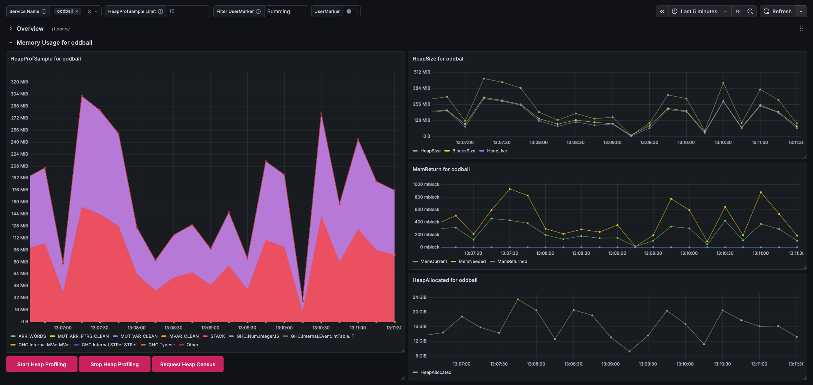
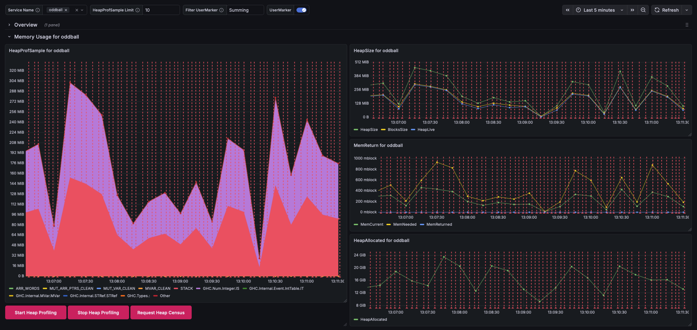
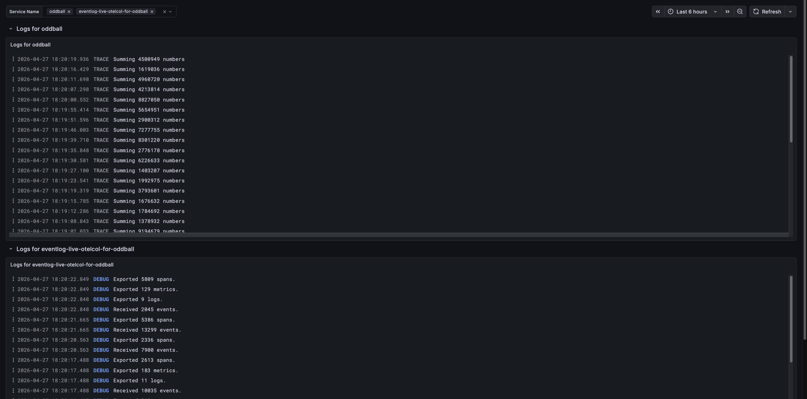
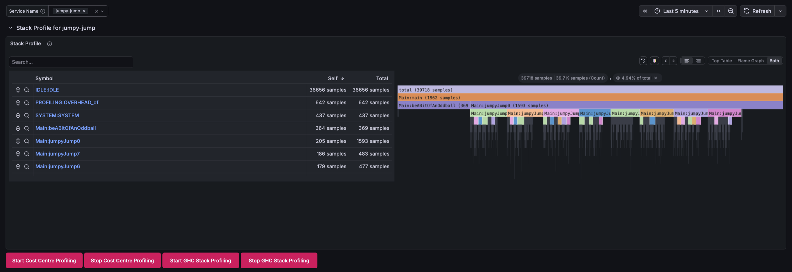
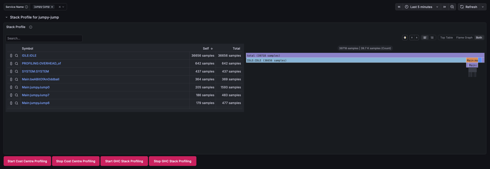
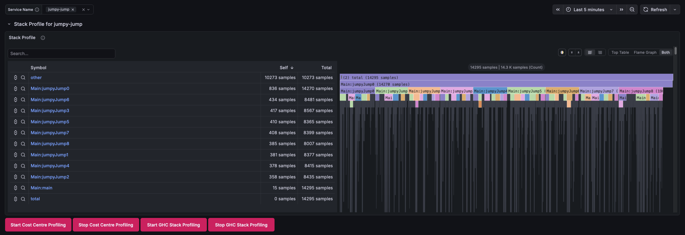
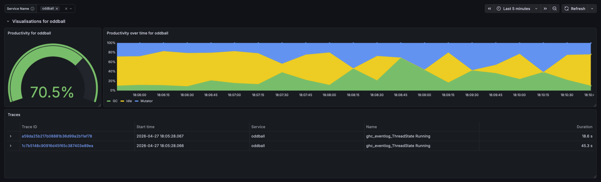
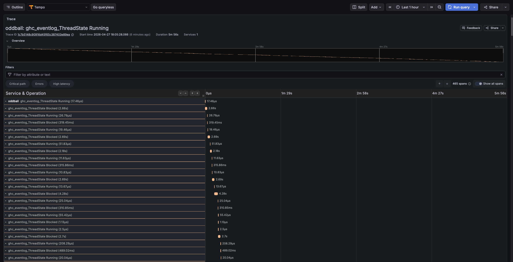

# `eventlog-live`

> [!WARNING]
> This package is experimental.
> It is versioned according to the [PVP](https://pvp.haskell.org).
> However, breaking changes should be expected and no effort will be
> made to avoid major version bumps until at least version 1.0.0.0.

This repository contains a collection of libraries and tools for the live profiling of Haskell applications instrumented with [`eventlog-socket`](https://github.com/well-typed/ghc-eventlog-socket).

## Demo

The [`demo`](demo/) directory contains a demo of `eventlog-live` monitoring the [`jumpy-jump`](examples/jumpy-jump/) example program.

To start the self-contained demo, run the following [Docker Compose](https://docs.docker.com/compose/) from the root of the repository.

```sh
docker compose -f demo/docker-compose.yml up --build
```

Once all containers have started, navigate to Grafana at <localhost:3000> and log in using username `admin` and password `admin`.

The Grafana instance comes with four preconfigured dashboards: Heap, Logs, Profiles, Threads.

### The Heap Dashboard

Navigate to the Heap dashboard under ☰ > _Dashboards_ > _Browse_ then _General_ > _Eventlog Heap_.



This dashboard has four visualisations which are repeated for each service selected in the _Service Name_ option (see the option bar).

- The _HeapProfSample_ visualisation shows a detailed heap profile for the service using the heap profile breakdown selected from command-line, by passing [`-h`](https://downloads.haskell.org/ghc/latest/docs/users_guide/profiling.html#rts-options-heap-prof) to the RTS options of the instrumented program and to `eventlog-live-otelcol`. The demo uses `-hT`, i.e., a breakdown by heap closure type. The number of distinct closure types shown is limited by the _HeapProfSample Limit_ option (see the option bar).

- The _HeapSize_ visualisation shows the current size of the heap. The [_HeapSize_](https://downloads.haskell.org/ghc/latest/docs/users_guide/eventlog-formats.html#event-type-HEAP_SIZE) and [_BlocksSize_](https://downloads.haskell.org/ghc/latest/docs/users_guide/eventlog-formats.html#event-type-BLOCKS_SIZE) metrics measure the current total size of the heap, based on the number of currently allocated megablocks or blocks, respectively. The [_HeapLive_](https://downloads.haskell.org/ghc/latest/docs/users_guide/eventlog-formats.html#event-type-HEAP_LIVE) metric measures the number of live bytes, based on the number of live blocks.

- The [_MemReturn_](https://downloads.haskell.org/ghc/latest/docs/users_guide/eventlog-formats.html#event-type-MEM_RETURN) visualisation shows information about the allocation of megablocks and attempts to return them to the OS. The _MemReturn_ metric measures the current number of allocated megablock, the _MemNeeded_ metric measures the number of megablocks currently needed, and the _MemReturned_ metric measures the number of megablocks returned to the OS. If your heap is fragmented then the current value will be greater than needed value but returned will be less than the difference between the two.

- The [_HeapAllocated_](https://downloads.haskell.org/ghc/latest/docs/users_guide/eventlog-formats.html#event-type-HEAP_ALLOCATED) visualisation shows the amount of memory allocated over time.

The buttoms below the _HeapProfSample_ visualisation control heap profiling in the instrumented program. This requires that both the instrumented program and `eventlog-live-otelcol` are built with the `control` flag. The _Start_ and _Stop_ buttons control the heap profiling timer in the instrumented program. If this is disabled, no detailed heap profile samples are taken, and the _HeapProfSample_ visualisation will flatline. However, the other three visualisations will continue to update. The _Request Heap Census_ button can be used to request a single detailed heap profile sample.

The _UserMarker_ switch and _Filter UserMarker_ option can be used to include user markers in the various visualisations. To enable user markers, flip the _UserMarker_ switch. To filter user markers, edit the regular expression in the _Filter UserMarker_ field. The oddball program emits a user marker every time it starts a large summation with the message "Summing N numbers". To show these markers, we flip the _UserMarker_ switch and type "Summing" in the _Filter UserMarker_ field.



To emit a user marker from your program, use [`traceMarker`](https://hackage-content.haskell.org/package/base/docs/Debug-Trace.html#v:traceMarker)/[`traceMarkerIO`](https://hackage-content.haskell.org/package/base/docs/Debug-Trace.html#v:traceMarkerIO).

### The Logs Dashboard

Navigate to the Logs dashboard under ☰ > _Dashboards_ > _Browse_ then _General_ > _Eventlog Logs_.



This dashboard has a single visualisation which is repeated for each service selected in the _Service Name_ option (see the option bar). For each user service there is a corresponding `eventlog-live-otelcol` service, e.g., for `oddball`, there is `eventlog-live-otelcol-for-oddball`.

- The _Logs_ visualisation shows log messages.

  For the instrumented program, the logs visualisation shows all messages emitted by user message tracing ([`traceEvent`](https://hackage-content.haskell.org/package/base/docs/Debug-Trace.html#v:traceEvent)/[`traceEventIO`](https://hackage-content.haskell.org/package/base/docs/Debug-Trace.html#v:traceEventIO)) and user marker tracing ([`traceMarker`](https://hackage-content.haskell.org/package/base/docs/Debug-Trace.html#v:traceMarker)/[`traceMarkerIO`](https://hackage-content.haskell.org/package/base/docs/Debug-Trace.html#v:traceMarkerIO)). As these functions do not set a severity, these messages are all assigned `TRACE` severity.

  For the corresponding `eventlog-live-otelcol` service, the logs visualisation shows the internal logs for that `eventlog-live-otelcol` instance. Logs that would not be shown under the given `--verbosity` command-line option will not available.

### The Profiles Dashboard

Navigate to the Profiles dashboard under ☰ > _Dashboards_ > _Browse_ then _General_ > _Eventlog Profiles_.



This dashboard has a single visualisation which is repeated for each service selected in the _Service Name_ option (see the option bar).

- The _Stack Profile_ visualisation shows a flamegraph and a table with the top symbols.

The `oddball` program used in the demo does not produce interesting profiles and profiles are disabled in the demo. The profiles shown in these screenshots are for the [`jumpy-jump`](examples/jumpy-jump/) program.

Stack profiles may be produced using [cost-centre profiling](https://downloads.haskell.org/ghc/latest/docs/users_guide/profiling.html) or by [`ghc-stack-profiler`](https://hackage.haskell.org/package/ghc-stack-profiler). For examples, see [`examples/jumpy-jump-otelcol-with-cost-centre-profiler.sh`](examples/jumpy-jump-otelcol-with-cost-centre-profiler.sh) and [`examples/jumpy-jump-otelcol-with-ghc-stack-profiler.sh`](examples/jumpy-jump-otelcol-with-ghc-stack-profiler.sh), respectively.

Be wary that cost-centre profiles and the call-stack profiles produced by `ghc-stack-profiler` can differ quite a lot for the same program. Cost-centre profiling maintains and samples a virtual cost-centre stack, whereas `ghc-stack-profiler` samples the call stack.

The following shows the _Stack Profile_ visualisation for the same cost-centre profile as above, but without focus on the `Main:main` symbol, which reveals the `IDLE:IDLE`, `PROFILING:OVERHEAD_of`, and `SYSTEM:SYSTEM` symbols.



The following shows the _Stack Profile_ visualisation for a call-stack profile produced by `ghc-stack-profiler`.



The buttoms below the _Stack Profile_ visualisation control stack profiling in the instrumented program. This requires that both the instrumented program and `eventlog-live-otelcol` are built with the `control` flag. The _Start_ and _Stop_ buttons control the sampler in the instrumented program. You should use the buttons that correspond to the kind of profiling for which your program is instrumented.

> [!WARNING]
> The _Stack Profile_ visualisation does not yet differentiate between the two kinds of stack profile.
> If you instrument a program to produce both kinds of profile, the visualisation will mix samples from both kinds.

### The Threads Dashboard

Navigate to the Threads dashboard under ☰ > _Dashboards_ > _Browse_ then _General_ > _Eventlog Threads_.



This dashboard has three visualisations which are repeated for each service selected in the _Service Name_ option (see the option bar).

- The _Productivity_ visualisation shows the average productivity over the current interval, i.e., the ratio between time spent running user code and time spent in garbage collection.

- The _Productivity over time_ visualisation shows the average productivity over time.

- The _Traces_ visualisation shows a table of capability and thread traces. If you click any of the trace IDs, you'll be taken to the trace exporer, where you can investigate the state of each thread over time.

  

> [!WARNING]
> The trace explorer view depends on the _CapabilityUsage_ and _ThreadState_ traces, which are numerous and can easily overwhelm the OpenTelemetry Collector. If the `eventlog-live-otelcol` log shows a stream of `EnhanceYourCalm` errors, these traces are the most likely culprit, and you may benefit from disabling them in your configuration file.

### The Docker Compose Files

The [Docker Compose](https://docs.docker.com/compose/) configuration `demo/docker-compose.yml` starts up a variety of containers.

- `oddball`, which repeatedly generates and sums random quantities of random numbers.
- `eventlog-live-otelcol`, which analyses the eventlog data from `oddball` and streams telemetry data to the OpenTelemetry Collector.
- The _OpenTelemetry Collector_, which streams the telemetry data to the various databases.
- _Loki_, which is a log processor and database.
- _Prometheus_, which is a _metric_ processor and database.
- _Tempo_, which is a _span_ processor and database.
- _Grafana_, which visualises the telemetry data from the various databases.

The configuration `demo/docker-compose-external.yml` allows you to reuse the services from the demo to monitor your own program. It starts up all of the above services, except for `oddball` and `eventlog-live-otelcol`. To use this file, run the following [Docker Compose](https://docs.docker.com/compose/) command from the root of the repository.

```sh
docker compose -f demo/docker-compose-external.yml up --build
```

Once all containers have started, you can run your own instrumented program together with your own local instance of `eventlog-live-otelcol`, and the telemetry data will be visualised in Grafana as above. The various example scripts will give you an idea of how to set this up. For instance, see [`examples/oddball/oddball-otelcol-with-hT.sh`](examples/oddball/oddball-otelcol-with-hT.sh).

> [!INFO]
> The `demo/docker-compose-external.yml` configuration _could_ be changed to include an instance of `eventlog-live-otelcol`. However, the instrumented program and `eventlog-live-otelcol` communicate the eventlog over a Unix domain socket and, unfortunately, exposing Unix domain sockets from the host OS to a container is not portable. The `eventlog-socket` library has recently added support for TCP/IPv4 sockets, which _could_ be used to solve this program. However, the eventlog socket is a very high bandwidth socket, so even when support for TCP/IPv4 is added to `eventlog-live-otelcol`, it is likely preferable to continue to use a Unix domain socket.

> [!WARNING]
> The `eventlog-live-otelcol` program is intended to analyse the eventlog and send telemetry data to an OpenTelemetry Collector. Currently, only the gRPC protocol is supported. If you wish to send telemetry data to some provider that only supports the HTTP/Protobuf protocol, such as HoneyComb or Grafana Cloud, you must run your own OpenTelemetry Collector and configure that to forward telemetry data to your provider.

## Getting Started

To use the code in this repository to profile your own application, follow these steps.

### Install `eventlog-live-otelcol`

This is the primary executable for `eventlog-live`. It can be installed using Cabal:

```sh
cabal install eventlog-live-otelcol
```

### Add `eventlog-socket` as a dependency

Add `eventlog-socket` to the `build-depends` for your application:

```cabal
executable my-app
  ...
  build-depends:
    ...
    , eventlog-socket  >=0.1.1 && <0.2
    ...
```

### Instrument your application for monitoring

To instrument your application, and allow the eventlog data to be streamed over a Unix socket, all you have to do is call `GHC.Eventlog.Socket.start` with the path to your socket.

```haskell
module Main where

import           Data.Foldable (traverse_)
import qualified GHC.Eventlog.Socket
import           System.Environment (lookupEnv)

main :: IO ()
main = do
  putStrLn "Creating eventlog socket..."
  traverse_ GHC.Eventlog.Socket.start =<< lookupEnv "GHC_EVENTLOG_UNIX_PATH"
  ...
```

This starts the `eventlog-socket` writer if the `GHC_EVENTLOG_UNIX_PATH` environment variable is set.

If you wish for your application to block until the client process connects to the eventlog socket, you can call `GHC.Eventlog.Socket.startWait`.

### Build your application for monitoring

To enable monitoring your application with `eventlog-live`, you must build it with some GHC options. If you're looking for options to copy, these are the minimal additions.

```diff
  executable my-app
    ...
+   ghc-options: -rtsopts
+   ghc-options: -threaded
+   if impl(ghc < 9.4)
+     ghc-options: -eventlog
    ...
```

Let's briefly discuss why these options are needed:

- The [`-rtsopts`](https://downloads.haskell.org/ghc/latest/docs/users_guide/phases.html#ghc-flag-rtsopts-none-some-all-ignore-ignoreAll) flag enables the RTS options for your application. This allows us to enable the eventlog at runtime and enable various kinds of profiling. Setting this option may pose a security risk. If this is a concern, you can set all the required RTS options at compile time using [`-with-rtsopts`](https://downloads.haskell.org/ghc/latest/docs/users_guide/phases.html#ghc-flag-with-rtsopts-opts). (See [the next section](#configuring-your-application-for-monitoring) for the necessary RTS options).

- The [`-eventlog`](https://downloads.haskell.org/ghc/latest/docs/users_guide/phases.html#ghc-flag-with-rtsopts-opts) flag builds eventlog support into your application. This is enabled unconditionally since GHC 9.4, but if you're using GHC 9.2 or earlier, you must explicitly pass this flag.

- The [`-threaded`](https://downloads.haskell.org/ghc/latest/docs/users_guide/phases.html#ghc-flag-threaded) flag builds your application with the threaded RTS. This is required because one crucial RTS option, `--eventlog-flush-interval`, is only safe to use with the threaded RTS.

### Configuring your application for monitoring

To monitor your application, you must pass certain [RTS options](https://downloads.haskell.org/ghc/latest/docs/users_guide/runtime_control.html#runtime-system-rts-options) to its runtime system. This can be done in any Haskell application built with `-rtsopts` (see [above](#build-your-application-for-monitoring)). If you're looking for some options to copy, these are the minimal additions. However, I encourage you to read the remainder of this section, as this specific configuration may have a significant performance impact on your application.

```sh
./my-app +RTS -l -hT --eventlog-flush-interval=1 -RTS
```

Let's briefly discuss the relevant RTS options and why they are needed.

#### Required flags

The [`-l`](https://downloads.haskell.org/ghc/latest/docs/users_guide/runtime_control.html#rts-flag-l-flags) flag tells the RTS to write the eventlog in binary form.

The [`--eventlog-flush-interval=N`](https://downloads.haskell.org/ghc/latest/docs/users_guide/runtime_control.html#rts-flag-eventlog-flush-interval-seconds) tells the RTS to flush the eventlog buffers every `N` seconds.

> [!WARNING]
> Flushing the eventlog may have a significant performance impact, as each flush requires all threads in your application to synchronise. To mitigate this impact, choose a higher value for `N`.

> [!WARNING]
> Setting `--eventlog-flush-interval=N` without `-threaded` throws an error in GHC 9.14 and later, and causes eventlog corruption in GHC version 9.12 an earlier.
> See GHC issue [#26222](https://gitlab.haskell.org/ghc/ghc/-/issues/26222) for details.

#### Heap profiling

The [`-h`](https://downloads.haskell.org/ghc/latest/docs/users_guide/profiling.html#rts-options-for-heap-profiling) flag tells the RTS to enable heap profiling, which provides a detailed breakdown of memory usage. This is required for the `heap_prof_sample` processor and the corresponding detailed breakdown in the demo.
Both the `-hT` and `-hi` flags are supported:

- The `-hT` flag tells the RTS to use the "closure type" breakdown, which is the most well-supported option and should work for every application without any further configuration.
- The `-hi` flag tells the RTS to use the "info table" breakdown, which may provide more detailed information, but requires compiling your application and its dependencies with the GHC option [`-finfo-table-map`](https://downloads.haskell.org/ghc/latest/docs/users_guide/debug-info.html#ghc-flag-finfo-table-map).

The `-hm`, `-hd`, `-hy`, `-he` and `-hr` flags are untested, but should work in theory.

The `-hc` and `-hb` flags are unsupported.

> [!WARNING]
> Heap profiling has a significant performance impact, as each sample requires a major garbage collection. The default sampling interval is 0.1, but this can be adjusted with the [`-i`](https://downloads.haskell.org/ghc/latest/docs/users_guide/profiling.html#rts-flag-i-secs) flag.
>
> Alternatively, heap profiling can be enabled/disabled from within your application using the functions in [`GHC.Profiling`](https://hackage.haskell.org/package/base/docs/GHC-Profiling.html). If you plan to use these functions, you can pass [`--no-automatic-heap-samples`](https://downloads.haskell.org/ghc/latest/docs/users_guide/profiling.html#rts-flag-no-automatic-heap-samples) to disable heap samples until you first call [`startHeapProfTimer`](https://hackage.haskell.org/package/base-4.21.0.0/docs/GHC-Profiling.html#v:startHeapProfTimer).

### Putting it all together

To visualise the profiling data of your instrumented application, you must connect it to the demo system.
The Docker Compose configuration in [`demo/docker-compose-external.yml`](demo/docker-compose-external.yml) sets up the same infrastructure used in the demo without the example application.

To use it, follow these steps:

1.  Run the following [Docker Compose](https://docs.docker.com/compose/) from the root of the repository.

    ```sh
    docker compose -f demo/docker-compose-external.yml up --build
    ```

2.  Set the `GHC_EVENTLOG_UNIX_PATH` environment variable:

    ```sh
    export GHC_EVENTLOG_UNIX_PATH="/tmp/my_eventlog.sock"
    ```

3.  Start your instrumented application:

    ```sh
    ./my-app +RTS -l -hT --eventlog-flush-interval=1
    ```

4.  Start `eventlog-live-otelcol`:

    ```sh
    eventlog-live-otelcol \
      --eventlog-socket "$GHC_EVENTLOG_UNIX_PATH" \
      -hT \
      --otelcol-host=localhost
    ```

### Fine-tuning `eventlog-live-otelcol`

The telemetry data produced by `eventlog-live-otelcol` can be configured in great detail via its configuration file in the YAML format. To print the [default configuration](eventlog-live-otelcol/data/default.yaml), as well as commentary explaining it, run the following command:

```sh
eventlog-live-otelcol --print-defaults
```

For validation and editor support, `eventlog-live-otelcol` ships with a JSON Schema for its configuration files. To print the [JSON Schema](eventlog-live-otelcol/data/config.schema.json), run the following command:

```sh
eventlog-live-otelcol --print-config-json-schema
```

If you use the RedHat YAML language server, you can instruct your editor to load this schema. See ["Associating a schema to a glob pattern via yaml.schemas"](https://github.com/redhat-developer/yaml-language-server?tab=readme-ov-file#associating-a-schema-to-a-glob-pattern-via-yamlschemas) in their README.

> [!NOTE]
> The configuration files are parsed using [`HsYAML`](https://hackage.haskell.org/package/HsYAML) which is a [YAML 1.2](https://yaml.org/spec/1.2/spec.html) compliant parser.
