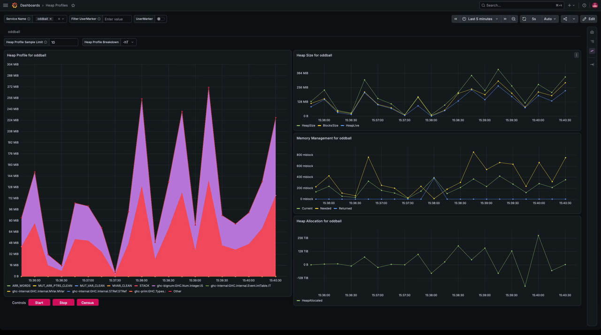
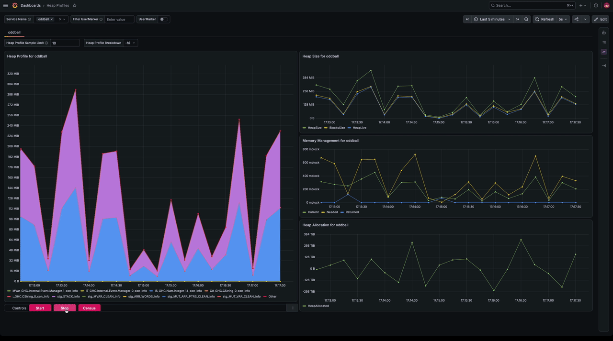
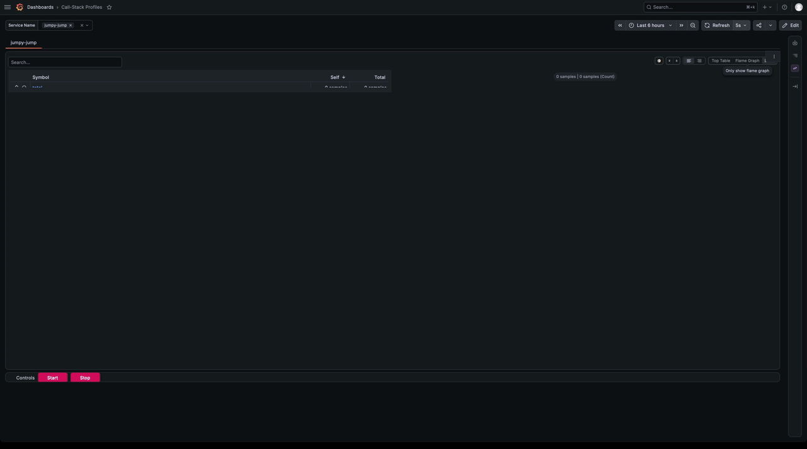
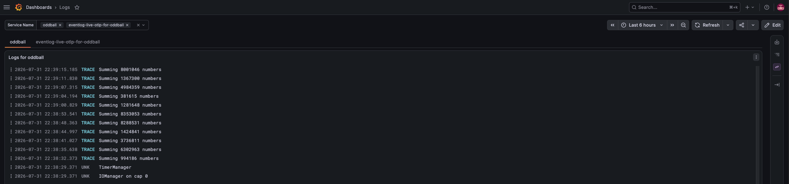
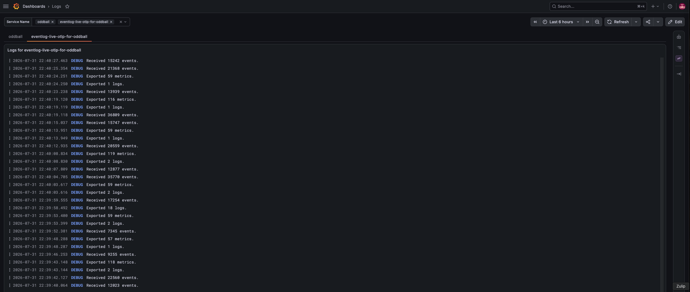
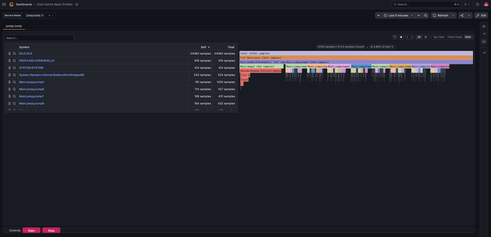
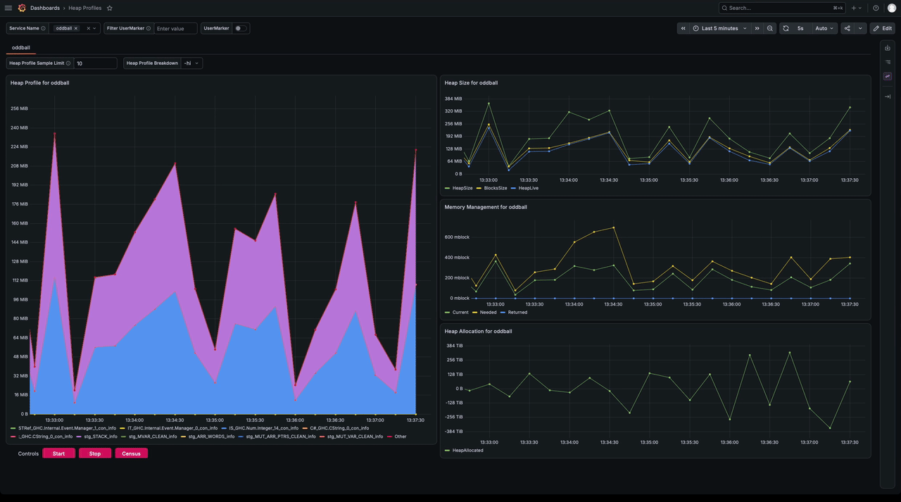

   

_Real-time monitoring for any Haskell application with little to no instrumentation!_

# Eventlog Live

> ⚠️ **Warning:**
> This package is experimental.
> It is versioned according to the [PVP](https://pvp.haskell.org).
> Breaking changes should be expected and no effort will be made to avoid major version bumps until at least version 1.0.0.0.

Eventlog Live analyses the [eventlog](https://ghc.gitlab.haskell.org/ghc/doc/users_guide/runtime_control.html#rts-eventlog) of any Haskell program and streams the resulting telemetry data to any observability platform that supports the OpenTelemetry protocol, such as [Grafana Cloud](https://grafana.com), [HoneyComb](https://www.honeycomb.io/), or [Prometheus](https://prometheus.io/docs/guides/opentelemetry/).

The following shows the Grafana Heap Profiles dashboard for [`oddball`](examples/oddball/oddball-with-pipe.sh) running with _zero instrumentation_.



Eventlog Live is designed to be _lightweight_, running alongside your application using only in a few megabytes of memory, and _highly configurable_, so that you only send the telemetry data you are interested in. While Eventlog Live works with zero instrumentation, it has support for several Haskell profiling packages that can enable new features.

- **Eventlog Socket – Sockets and Dynamic Control**

  The [`eventlog-socket`](https://github.com/well-typed/eventlog-socket) package adds two features. First, it lets you to stream the eventlog over Unix domain and TCP/IP sockets. Secondly, it lets you control your program from the observability dashboard. The `eventlog-socket` instrumentation has builtin support that lets you toggle RTS features such as heap and stack profiling at runtime, but its control protocol has an easy-to-use plugin mechanism that lets you integrate other actions into your telemetry platform.

  The following shows dynamic control of heap profiling from the Grafana Heap Profiles dashboard for [`oddball`](examples/oddball/oddball-with-hT.sh) instrumented with `eventlog-socket`. When the _Stop_ button is pressed, the heap profiling is stopped, and the heap profile flatlines. When the _Start_ button is pressed, heap profiling is restarted.

  

- **GHC Stack Profiler – Lightweight Call-Stack Profiles**

  The [`ghc-stack-profiler`](https://github.com/well-typed/ghc-stack-profiler) package lets you sample your application's call-stack using a lightweight sampler that can be turned on and off at runtime using `eventlog-socket`'s control protocol.

  The lightweight call-stack sampler has an approximate 5-10% overhead while running with a sampling interval of 10ms, whereas [GHC's builtin cost-centre profiling](https/downloads.haskell.org/ghc/latest/docs/users_guide/profiling.html#time-and-allocation-profiling) has an approximate 50% overhead for the instrumentation alone, i.e., prior to any cost-centres and without sampling.

  The following shows the Grafana Call-Stack Profiles dashboard for [`jumpy-jump`](examples/jumpy-jump/jumpy-jump-with-ghc-stack-profiler.sh) instrumented with `ghc-stack-profiler`.

  

## Demos

The [`demo`](demo/) directory contains a [Docker Compose](https://docs.docker.com/compose/) configuration that runs Grafana and all required data sources and opens an OTLP gRPC receiver on port 4317. This configuration is used in [Getting Started](#getting-started) and by the various scripts under the [`examples`](examples/) directory.
You can import the dashboards under [`demo/config/grafana-dashboards`](demo/config/grafana-dashboards/) into your Grafana setup, but beware that you'll have to change the variables and visualisations to use your data sources and change the buttons to use your control server.
The dashboards under [`demo-grafana-cloud`](demo-grafana-cloud/grafana-dashboards/) were prepared to be shared with other Grafana instances.

The [`demo-grafana-cloud`](demo-grafana-cloud/) directory contains an example that runs `jumpy-jump` and Eventlog Live, and sends data directory to Grafana Cloud. This demo shows heap profiles, logs, and cost-centre stack profiles.

The [`demo-nix`](demo-nix/) directory contains a [Nix](https://nixos.org) configuration that builds a self-contained virtual machine that runs `oddball`, Eventlog Live, Grafana, and Prometheus. This demo shows heap profiles.

## Getting Started

Let's get Evenlog Live working with your application, which we'll conveniently call `your-application`.

We'll start by getting the basic version of Evenlog Live working and progressively add features.

### Eventlog Live – The Basic Version

For the barebones version, you need three things:

1.  You need Eventlog Live, specifically the `eventlog-live-otlp` executable.

    To build Eventlog Live from source, you'll need:
    - GHC version 9.4 up to 9.12 (inclusive).
    - Cabal version 3.12 or later.
    - A recent [Protocol Buffer Compiler](https://protobuf.dev/installation/).

    Run:

    ```sh
    cabal install eventlog-live:eventlog-live-otlp \
      --constraint='blockio +serialblockio'        \
      --constraint='grpc-spec -snappy'
    ```

    The `+serialblockio` flag makes `blockio` use serial I/O, as opposed to parallel I/O. If you are on Linux and have [`liburing`](https://github.com/axboe/liburing) installed, you can omit this flag and get slightly faster disk I/O.

    The `-snappy` flag makes `grpc-spec` support snappy compression. If you have [snappy](https://github.com/google/snappy) installed, you can omit this flag and get slightly faster gRPC compression.

2.  You must have _somewhere_ to send the telemetry data.

    Any observability platform that supports OpenTelemetry works. The [demo-grafana-cloud](demo-grafana-cloud/) has a guide for setting up [Grafana Cloud](https://grafana.com).
    For the purposes of this guide, you can run the following [Docker Compose](https://docs.docker.com/compose/) from the root of the repository.

    ```sh
    docker compose -f demo/docker-compose-external.yml up --build --detach
    ```

    Eventlog Live supports [OpenTelemetry environment variables](https://opentelemetry.io/docs/specs/otel/configuration/sdk-environment-variables). For this guide, we'll assume you used the docker command, which starts an OLTP gRPC receiver on port 4317. If you're using some other endpoint, you'll have to adapt these configuration options.

3.  Your application must be compiled with support for RTS options, the threaded runtime, and the eventlog.

    Add the following to the `executable` section of `your-application.cabal`:

    ```diff
      executable my-app
        ...

    +   ghc-options: -rtsopts
    +   ghc-options: -threaded
    +   if impl(ghc < 9.4)
    +     ghc-options: -eventlog
    ```

    The [`-rtsopts`](https://downloads.haskell.org/ghc/latest/docs/users_guide/phases.html#ghc-flag-rtsopts-none-some-all-ignore-ignoreAll) flag enables the RTS options for your application. This allows us to enable the eventlog at runtime and enable various kinds of profiling. Setting this option may pose a security risk. If this is a concern, you can set all the required RTS options at compile time using [`-with-rtsopts`](https://downloads.haskell.org/ghc/latest/docs/users_guide/phases.html#ghc-flag-with-rtsopts-opts). (See [the next section](#configuring-your-application-for-monitoring) for the necessary RTS options).

    The [`-eventlog`](https://downloads.haskell.org/ghc/latest/docs/users_guide/phases.html#ghc-flag-with-rtsopts-opts) flag builds eventlog support into your application. This is enabled unconditionally since GHC 9.4, but if you're using GHC 9.2 or earlier, you must explicitly pass this flag.

    The [`-threaded`](https://downloads.haskell.org/ghc/latest/docs/users_guide/phases.html#ghc-flag-threaded) flag builds your application with the threaded RTS. This is required because one crucial RTS option, `--eventlog-flush-interval`, is only safe to use with the threaded RTS.

To start monitoring your application, pipe its eventlog to Eventlog Live:

```sh
# OpenTelemetry Configuration
export OTEL_LOG_LEVEL="debug"
export OTEL_SERVICE_NAME="your-application"
export OTEL_EXPORTER_OTLP_PROTOCOL="grpc"

# Create a pipe for the eventlog
EVENTLOG_PIPE="/tmp/eventlog.pipe"
mkfifo "${EVENTLOG_PIPE}"

# Start your application
your-application                     \
  +RTS                               \
  -l                                 \
  -ol"${EVENTLOG_PIPE}"              \
  -hT                                \
  --eventlog-flush-interval=1        \
  -RTS                               &

# Start eventlog-live-otlp
eventlog-live-otlp                   \
  --eventlog-file="${EVENTLOG_PIPE}" \
  -hT                                \
  --eventlog-flush-interval=1

# See: examples/oddball/oddball-with-pipe.sh
```

If you run these commands, you should start seeing telemetry show up on your dashboard.

- Navigate to Grafana at <localhost:3000>.
- Log in with username `admin` and password `admin`.
- Select '☰ > Dashboards > Heap Profiles'

  You should be greeted by a dashboard that looks something like this:

  

- Select '☰ > Dashboards > Logs'

  You should be greeted by a dashboard that looks something like this:

  

  This dashboard will include a separate tab that shows the logs for `eventlog-live-otlp`:

  

Let's briefly discuss what this script does:

- **The OpenTelemetry Configuration.**

  The Eventlog Live exporter is configured using the [OpenTelemetry environment variables](https://opentelemetry.io/docs/specs/otel/configuration/sdk-environment-variables).
  - `OTEL_LOG_LEVEL` sets Eventlog Live's log level.
  - `OTEL_SERVICE_NAME` sets the service name under which your application's telemetry shows up on your dashboard.
  - `OTEL_EXPORTER_OTLP_PROTOCOL` selects the exporter's protocol. The default is `http/protobuf`, but the docker setup uses gRPC. If the protocol is gRPC, the default endpoint is `http://localhost:4317`, which is what our docker setup uses.

- **The Eventlog.**

  In this example, the eventlog is sent from your application's RTS to Eventlog Live via a named pipe.
  The [`mkfifo`](https://www.man7.org/linux/man-pages/man1/mkfifo.1.html) command creates a named pipe.
  The [`-l`](https://downloads.haskell.org/ghc/latest/docs/users_guide/runtime_control.html#rts-flag-l-flags) flag passed to your application's RTS tells it to write the eventlog in binary form and the [`-ol`](https://downloads.haskell.org/ghc/latest/docs/users_guide/runtime_control.html#rts-flag-olfilename) flag tells it to write it to the named pipe.
  The `--eventlog-file` flag passed to Eventlog Live tells it to read the eventlog from the named pipe.

- **Eventlog flushing**.

  The [`--eventlog-flush-interval=1`](https://downloads.haskell.org/ghc/latest/docs/users_guide/runtime_control.html#rts-flag-eventlog-flush-interval-seconds) flag passed to your application's RTS tells it to flush the eventlog every second.

  The `--eventlog-flush-interval=1` flag passed to Eventlog Live tells it your application's flush interval.

  The eventlog must be sorted for various analyses. In the RTS, events accumulate in per-capability buffers, which are usually only flushed when they fill up. This makes it impossible to sort the incoming eventlog, as events could be arbitrarily delayed.

  Flushing the eventlog may have a significant performance impact, as each flush requires all threads in your application to synchronise. To mitigate this, you may want to increase the flush interval in production.
  As a rule of thumb:
  - If you pass `--eventlog-flush-interval=N` to your application, it synchronises all threads every `N` seconds.

  - If you pass `--eventlog-flush-interval=N` to Eventlog Live, your telemetry data is delayed by at least `2N` seconds, more if you configure longer aggregation or export intervals.

  Usually, you want to pass the same value to both your application and Eventlog Live. However, there is no harm in passing Eventlog Live a higher value and, if you are seeing many out-of-order event warnings, doing so may solve that.

  > ⚠️ **Warning:**
  > Passing `--eventlog-flush-interval=N` to an executable that was built without `-threaded` throws an error in GHC 9.14 and later, and causes eventlog corruption in GHC version 9.12 an earlier.
  > See GHC issue [#26222](https://gitlab.haskell.org/ghc/ghc/-/issues/26222) for details.

- **Heap profiles.**

  The [`-h`](https://downloads.haskell.org/ghc/latest/docs/users_guide/profiling.html#rts-options-for-heap-profiling) flag passed to your application's RTS tells it to enable Heap Profiling, which provides a detailed breakdown of memory usage.
  The `T` argument selects the "closure type" breakdown, which is the most well-supported breakdown and should work for every application without any further configuration. This will tell you which symbol is responsible for each heap segment, e.g., `ghc-prim:GHC.Tuple.(,)`.
  (Heap Profiling by Info Table is discussed under [Eventlog Live with Heap Profiling by Info Table](#eventlog-live-with-heap-profiling-by-info-table).)

  The `-hT` flag passed to Eventlog Live tells it your application's heap profile breakdown.
  This is only needed if your application was built wih GHC 9.12 or older, as those versions did not send the heap profile breakdown over the eventlog, but there's no harm in passing it even if your application was built with a more recent version of GHC.

  > ⚠️ **Warning:**
  > Heap profiling has a significant performance impact, as each sample requires a major garbage collection. The default sampling interval is 0.1, but this can be adjusted with the [`-i`](https://downloads.haskell.org/ghc/latest/docs/users_guide/profiling.html#rts-flag-i-secs) flag.
  >
  > Heap profiling can be enabled/disabled at runtime from within your application using the functions in [`GHC.Profiling`](https://hackage.haskell.org/package/base/docs/GHC-Profiling.html). If you plan to use these functions, you can pass [`--no-automatic-heap-samples`](https://downloads.haskell.org/ghc/latest/docs/users_guide/profiling.html#rts-flag-no-automatic-heap-samples) to disable heap samples until you first call [`startHeapProfTimer`](https://hackage.haskell.org/package/base-4.21.0.0/docs/GHC-Profiling.html#v:startHeapProfTimer).
  >
  > Alternatively, heap profiling can be enabled/disabled by Eventlog Live, e.g., using the Start/Stop buttons on the Heap Profiles dashboard. This requires that your application was instrumented with `eventlog-socket` using the `+control` flag. This is discussed under [Eventlog Live with Eventlog Socket](#eventlog-live-with-eventlog-socket).

### Eventlog Live with Eventlog Socket

Eventlog Socket gives us two things:

- If instrumented with Eventlog Socket, your application can write the eventlog to a Unix domain socket or a TCP/IP socket.

- If `eventlog-socket` is compiled with the `+control` feature flag, your application can read control messages from the eventlog socket. The builtin control messages can be used, e.g., to enable/disable heap or stack profiling at runtime. However, Eventlog Socket's control protocol is extensible. You can register new command messages from within your application using any Haskell function as their callbacks.

  > ⚠️ **Warning:**
  > For security reasons, the Eventlog Socket control protocol is hidden behind a feature flag. If you do not enable the `+control` feature flag at compile time, none of the code that handles the the control protocol will be present in the library.

To instrument your application with Eventlog Socket, you need to make four small changes:

1.  Add `eventlog-socket` to the `build-depends` for your application:

    ```diff
    executable your-application
      ...

      build-depends:
        ...
    +   , eventlog-socket  >=0.1.2 && <0.2
    ```

2.  Instrument your main function:

    ```diff
    module Main where
    ...

    + import qualified GHC.Eventlog.Socket

    main :: IO ()
    main = do
    + GHC.Eventlog.Socket.startFromEnv
      ...
    ```

    There are various ways to start Eventlog Socket. For more details, see [the Haddock documentation](https://hackage-content.haskell.org/package/eventlog-socket-0.1.3.0/docs/GHC-Eventlog-Socket.html).
    The [`startFromEnv`](https://hackage-content.haskell.org/package/eventlog-socket-0.1.3.0/docs/GHC-Eventlog-Socket.html#v:startFromEnv) function reads the Eventlog Socket configuration from environment variables:
    - If `GHC_EVENTLOG_UNIX_PATH` is set,
      it opens a Unix domain socket at the given path.
    - If `GHC_EVENTLOG_INET_HOST` and `GHC_EVENTLOG_INET_PORT` are set,
      it opens a TCP/IP socket at the given address.
    - If `GHC_EVENTLOG_WAIT` is set,
      it pauses the program until some other process connects to the socket.

3.  Build your application with support for the control protocol.

    You must ensure that its `eventlog-socket` dependency is built with the `+control` feature flag.
    - During development, the easiest way to do this is to add the following to your `cabal.project` file:

      ```
      package eventlog-socket
        flags:
          +control
      ```

    - During installation, the easiest way to do this is to pass the `--constraint` flag:

      ```sh
      cabal install your-application \
        --constraint='eventlog-socket +control'
      ```

4.  Build Eventlog Live with support for the control server.

    You must ensure that `eventlog-live-otlp` is built with the `+control` feature flag.

    ```sh
    cabal install eventlog-live:eventlog-live-otlp \
      -f+control                                   \
      --constraint='blockio +serialblockio'        \
      --constraint='grpc-spec -snappy'
    ```

    When built with the `+control` feature flag, Eventlog Live supports starting the control server, an HTTP server that offers a REST interface to the control protocol, which you can call from, e.g., the buttons on your Grafana dashboard.

To start monitoring your application, pass the same socket to it and Eventlog Live:

```sh
# Eventlog Socket Configuration
export GHC_EVENTLOG_UNIX_PATH="/tmp/eventlog.sock"
export GHC_EVENTLOG_WAIT="true"

# OpenTelemetry Configuration
export OTEL_LOG_LEVEL="debug"
export OTEL_SERVICE_NAME="your-application"
export OTEL_EXPORTER_OTLP_PROTOCOL="grpc"

# Start your application
your-application                                \
  +RTS                                          \
  -l                                            \
  -hT                                           \
  --eventlog-flush-interval=1                   \
  -RTS                                          &

# Start eventlog-live-otlp
eventlog-live-otlp                              \
  --eventlog-socket="${GHC_EVENTLOG_UNIX_PATH}" \
  -hT                                           \
  --eventlog-flush-interval=1                   \
  --control                                     \
  --control-port=30719                          \
  --control-cors-ignore-failure

# See: examples/oddball/oddball-with-hT.sh
```

If you run these commands, you should be greeted by a dashboard that looks something like this:


The Start and Stop buttons can now be used to enable/disable Heap Profiling and the Census button can now be used to request a single heap census.

Let's briefly discuss what the new parts of this script do:

- The `GHC_EVENTLOG_UNIX_PATH` and `GHC_EVENTLOG_WAIT` environment variables configure Eventlog Socket, see above.

- The `--control` and `--control-port=30719` flags passed to Eventlog Live tells it to start the control server on port 30719, which is the port used in the Grafana dashboards included in the demo.

- The `--control-cors-ignore-failure` flag passed to Eventlog Live tells it to ignore and accept malformed [CORS preflight requests](https://en.wikipedia.org/wiki/Cross-origin_resource_sharing).
  This is a workaround for Safari's broken CORS preflight requests for localhost.
  You should not pass this flag in production.

### Eventlog Live with Cost-Centre Stack Profiling

Cost-Centre Stack Profiling is [GHC's builtin time profiler](https://downloads.haskell.org/ghc/latest/docs/users_guide/profiling.html#time-and-allocation-profiling). When enabled, cost-centre profiling maintains virtual cost-centre stacks that contain entries for all symbols marked as cost centres.

To use Cost-Centre Stack Profiling, you must make two changes:

1.  Build your application and its dependencies must be built with profiling.
    - During development, the easiest way to do this is to add the following to your `cabal.project` file:

      ```
      profiling: True
      ```

    - During installation, the easiest way to do this is to pass the `--enable-profiling` flag:

      ```sh
      cabal install your-application --enable-profiling
      ```

2.  Add cost centres to your application.

    If you are only interested in specific symbols, you can manually add cost centres using the `SCC` pragma, e.g.,

    ```diff
    + {-# SCC myGreeter #-}
      myGreeter :: String -> String
      myGreeter name = "Hello, " <> name
    ```

    If you would like to automatically add cost centres for all symbols, you can use the Cabal [`profiling-detail`](https://cabal.readthedocs.io/en/3.18/cabal-project-description-file.html#cfg-flag---profiling-detail) option.
    The easiest way to add cost centres for all packages is to add the following to your `cabal.project` file:

    ```
    package *
      profiling-detail: late
    ```

    There are several different strategies, e.g., `all-functions` and `late`.
    Our recommendation is to use `late`.
    See [Late Cost Centre Profiling](https://well-typed.com/blog/2023/03/prof-late/).

To start monitoring your application, run your application and Evenlog Live. The following script builds on the example from [Eventlog Live with Eventlog Socket](#eventlog-live-with-eventlog-socket), but using Cost-Centre Stack Profiling is independent from Eventlog Socket.

```sh
# Eventlog Socket Configuration
export GHC_EVENTLOG_UNIX_PATH="/tmp/eventlog.sock"
export GHC_EVENTLOG_WAIT="true"

# OpenTelemetry Configuration
export OTEL_LOG_LEVEL="debug"
export OTEL_SERVICE_NAME="your-application"
export OTEL_EXPORTER_OTLP_PROTOCOL="grpc"

# Start your application
your-application                                \
  +RTS                                          \
  -l                                            \
  -p                                            \
  --eventlog-flush-interval=1                   \
  -RTS                                          &

# Start eventlog-live-otlp
eventlog-live-otlp                              \
  --eventlog-socket="${GHC_EVENTLOG_UNIX_PATH}" \
  --eventlog-flush-interval=1                   \
  --control                                     \
  --control-port=30719                          \
  --control-cors-ignore-failure

# See: examples/jumpy-jump/jumpy-jump-with-cost-centre-profiler.sh
#      examples/jumpy-jump/jumpy-jump-with-cost-centre-profiler-with-pipe.sh
```

If you run these commands, you should start seeing profiles show up on your dashboard.

- Navigate to Grafana at <localhost:3000>.
- Log in with username `admin` and password `admin`.
- Select '☰ > Dashboards > Cost-Centre Stack Profiles'

  You should be greeted by a dashboard that looks something like this:

  

If your application is instrumented with Eventlog Socket, the Start and Stop buttons should enable/disable cost-centre stack profiling.

Let's briefly discuss what the new parts of this script do:

- The [`-p`](https://downloads.haskell.org/ghc/latest/docs/users_guide/profiling.html#time-and-allocation-profiling) flag passed to your application's RTS tells it to enable Cost-Centre Stack Profiling.

> ℹ️ **Tip:**
> When compared to call-stack profiling, a cost-centre stack profile more closely models user expectation.
> For example, in a recursive loop without allocations, the recursive function is not pushed onto the call-stack, and won't show up in a call-stack profile. However, its cost centres _will_ be pushed to the virtual cost-centre stack.

> ⚠️ **Warning:**
> Cost-centre profiling has a huge runtime overhead. When compiled with profiling, the in-memory representation of all datatypes grows by one word and this alone results in a 50% runtime overhead even without any cost centres and even while running without `-p`, e.g., without maintaining the virtual cost-centre stacks. For production environments, we recommend running GHC Stack Profiler. See [Eventlog Live with GHC Stack Profiler](#eventlog-live-with-ghc-stack-profiler).

### Eventlog Live with Heap Profiling by Info Table

In [Eventlog Live – The Basic Version](#eventlog-live-the-basic-version), we told your application's RTS to enable heap profiling, using a breakdown by closure type (`-hT`). While this is incredibly useful, there's a good chance one of the largest categories will be something like `STACK` or `THUNK`.
We can use Heap Profiling by Info Table to get a much more detailed breakdown.

To use Heap Profiling by Info Table, your application and all its dependencies must be built with the GHC options [`-finfo-table-map`](https://downloads.haskell.org/ghc/latest/docs/users_guide/debug-info.html#ghc-flag-finfo-table-map) and [`-fdistinct-constructor-tables`](https://downloads.haskell.org/ghc/latest/docs/users_guide/debug-info.html#ghc-flag-fdistinct-constructor-tables) GHC options.

Let's do this in two steps:

1.  To build your application and its dependencies with info table maps, you must ensure that they are built with the `-finfo-table-map` and `-fdistinct-constructor-tables` GHC options.

    The easiest way to do this is to add the following to your `cabal.project` file:

    ```
    package *
      ghc-options:
        -finfo-table-map
        -fdistinct-constructor-tables
    ```

    There is currently no easy way to pass GHC options to all packages when using `cabal install`.
    As a workaround, you can add a `cabal.project` file to a source distribution and install from there.

If you run Heap Profiling by Info Table with your application built this way, you will get detailed information for all the symbols defined in your application and most symbols defined in your dependencies.
However, you will see some unresolved info tables, which will show as numbers, e.g., `0x100000000`.
These are symbols that are either built into GHC or defined in the [_boot libraries_](https://gitlab.haskell.org/ghc/ghc/-/wikis/working-conventions/boot-libraries) that came with GHC, such as `base`.
The boot packages are _never_ rebuilt by Cabal and are unaffected by the `package *` stanza.

2.  To build the GHC and the boot libaries with info table maps, you must build GHC with the `+ipe` flavour.

    The easiest way to do this is using `ghcup`. Some variant of the following command may work for you:

    ```sh
    ghcup compile ghc -j0 -b 9.10.3 -v 9.10.3 -f perf+ipe -o '%v-ipe' --
    ```

    You may need to pass the appropriate configure flags for your platform.
    See [Building and Porting GHC](https://gitlab.haskell.org/ghc/ghc/-/wikis/building#building-and-porting-ghc).

Once you have a version of GHC built with the `+ipe` flavour, you can rebuild your application, and start using Heap Profiling by Info Table. The following script builds on the example from [Eventlog Live with Eventlog Socket](#eventlog-live-with-eventlog-socket), but Heap Profiling by Info Table is independent from Eventlog Socket.

```sh
# Eventlog Socket Configuration
export GHC_EVENTLOG_UNIX_PATH="/tmp/eventlog.sock"
export GHC_EVENTLOG_WAIT="true"

# OpenTelemetry Configuration
export OTEL_LOG_LEVEL="debug"
export OTEL_SERVICE_NAME="your-application"
export OTEL_EXPORTER_OTLP_PROTOCOL="grpc"

# Start your application
your-application                                \
  +RTS                                          \
  -l                                            \
  -hi                                           \
  --eventlog-flush-interval=1                   \
  -RTS                                          &

# Start eventlog-live-otlp
eventlog-live-otlp                              \
  --eventlog-socket="${GHC_EVENTLOG_UNIX_PATH}" \
  -hi                                           \
  --eventlog-flush-interval=1                   \
  --control                                     \
  --control-port=30719                          \
  --control-cors-ignore-failure

# See: examples/oddball/oddball-with-hi.sh
```

If you run these commands, you should be greeted by a dashboard that looks something like this:



Notably, your Heap Profile should show Info Table information. If you ran Heap Profiles with different breakdowns, you can select the appropriate breakdown in the Heap Profile Breakdown dropdown menu.

Let's briefly discuss what the new parts of this script do:

- The [`-hi`](https://downloads.haskell.org/ghc/latest/docs/users_guide/profiling.html#rts-options-for-heap-profiling) flag passed to your application's RTS tells it to enable Heap Profiling by Info Table.

  As before, the `-hi` flag passed to Eventlog Live tells it your application's heap profile breakdown.

### Eventlog Live with GHC Stack Profiler

[GHC Stack Profiler](https://github.com/well-typed/ghc-stack-profiler) is a lightweight profiler that samples the runtime call-stack and writes these to the eventlog. It only has an 5-10% overhead while running. When compiled with the `+control` feature flag, it supports Eventlog Socket's command protocol, which lets you enable/disable samples at runtime.

To instrument your application with GHC Stack Profiler, you need to make three changes:

1. Add `ghc-stack-profiler` to the `build-depends` for your application:

   ```diff
   executable your-application
     ...

     build-depends:
       ...
   +   , ghc-stack-profiler >=0.4 && <0.5
   ```

2. Instrument your main function:

   ```diff
     module Main where
     ...

   + import qualified GHC.Stack.Profiler as GSP

     main :: IO ()
     main = do
   +   GSP.withRootStackProfiler True $ \manager ->
   +     GSP.withStackProfiler manager (GSP.SampleIntervalMs 100) $
           ...
   ```

   The current version of GHC Stack Profiler requires you to set the sampling interval at compile-time.

3. Build your application and its dependencies with info table maps.

   For detailed instructions, see [Eventlog Live with Heap Profiling by Info Table](#eventlog-live-with-heap-profiling-by-info-table).

To start monitoring your application, run your application and Evenlog Live. The following script builds on the example from [Eventlog Live with Heap Profiling by Info Table](#eventlog-live-with-heap-profiling-by-info-table), but using GHC Stack Profiler is independent from Eventlog Socket and while it needs info table maps, it does not require _running_ an Info Table Profile (`-hi`).

```sh
# Eventlog Socket Configuration
export GHC_EVENTLOG_UNIX_PATH="/tmp/eventlog.sock"
export GHC_EVENTLOG_WAIT="true"

# OpenTelemetry Configuration
export OTEL_LOG_LEVEL="debug"
export OTEL_SERVICE_NAME="your-application"
export OTEL_EXPORTER_OTLP_PROTOCOL="grpc"

# Start your application
your-application                                \
  +RTS                                          \
  -l                                            \
  -hi                                           \
  --eventlog-flush-interval=1                   \
  -RTS                                          &

# Start eventlog-live-otlp
eventlog-live-otlp                              \
  --eventlog-socket="${GHC_EVENTLOG_UNIX_PATH}" \
  -hi                                           \
  --eventlog-flush-interval=1                   \
  --control                                     \
  --control-port=30719                          \
  --control-cors-ignore-failure

# See: examples/jumpy-jump/jumpy-jump-with-ghc-stack-profiler.sh
```

If you run these commands, you should start seeing profiles show up on your dashboard.

- Navigate to Grafana at <localhost:3000>.
- Log in with username `admin` and password `admin`.
- Select '☰ > Dashboards > Call-Stack Profiles'

  You should be greeted by a dashboard that looks something like this:

  

If your application is instrumented with Eventlog Socket, the Start and Stop buttons should enable/disable call-stack profiling.

> ℹ️ **Tip:**
> You can use the [`annotateStackIO`](https://hackage-content.haskell.org/package/ghc-experimental-9.1401.0/docs/GHC-Stack-Annotation-Experimental.html#v:annotateStackIO) functions from `ghc-experimental` to push annotation frames onto the call-stack at runtime.
> These annotation frames are visible in call-stack profiles captured by GHC Stack Profiler.
> See [Better Haskell stack traces via user annotations](https://www.well-typed.com/blog/2025/09/better-haskell-stack-traces/).

> ⚠️ **Warning:**
> Due to a bug in GHC, copying the call-stack may cause a segfault at runtime in applications built with GHC 9.14 and older.
> If you use GHC Stack Profiler in production, you should build your application with GHC 10 or later.

## Fine-Tuning Eventlog Live

### Configuration Files

The telemetry data produced by Eventlog Live can be configured in great detail via configuration files.
These let you enable/disable each individual telemetry stream and control their aggregation and export intervals.
The [default configuration](eventlog-live-otlp/data/default.yaml) file contains comments that explain what each option means.
To get started, you can write the default configuration to a file using the following command:

```sh
eventlog-live-otlp --print-defaults > eventlog-live.yaml
```

To pass a configuration file to Eventlog Lie, use the `--config` flag:

```sh
eventlog-live-otlp --config=eventlog-live.yaml ...
```

For validation and editor support, Eventlog Live ships with a JSON Schema for the configuration file format.
To print the [JSON Schema](eventlog-live-otlp/data/config.schema.json), run the following command:

```sh
eventlog-live-otlp --print-config-json-schema
```

> ℹ️ **Tip:**
> If you use the RedHat YAML language server, you can instruct your editor to load this schema.
> See [Associating schemas](https://github.com/redhat-developer/yaml-language-server/blob/538c8abb924acf727a136351a42a0c34a8b35bae/README.md#associating-schemas).

> ℹ️ **Tip:**
> The configuration files are parsed using [`HsYAML`](https://hackage.haskell.org/package/HsYAML) which is a [YAML 1.2](https://yaml.org/spec/1.2/spec.html) compliant parser.

### Restricted Event Classes

If you're only interested in particular kinds of telemetry signals, you may be able to configure your application to only write out certain classes of events. This can help save memory usage and bandwidth on the eventlog pipe or socket.

For example, if you're not interested in productivity and the thread state and capability usage spans (which are disabled by default), you can disable the class of scheduler events. Replace the `-l` flag passed to your application's RTS with `-la-s` (which means "all minus scheduler").

```diff
  your-application \
    +RTS           \
-   -l             \
+   -la-s          \
    ...
```

For a detailed overview of event classes, see [GHC's users guide](https://downloads.haskell.org/ghc/latest/docs/users_guide/runtime_control.html#rts-flag-l-flags).

### Info Table and Cost-Centre Databases

If your application is particularly large, you might want to strip its info table or cost centre maps.
You can use [IpeDB](https://github.com/well-typed/ipedb) to build an info table database or cost centre database for your executable.
These databases can be passed to Eventlog Live via the `--ipedb` and `--ccdb` flags.
Once you have built an info table database for your application, you can safely make the following changes:

- If you application was built with GHC 10 or later, you can also restrict the IPE event class using `I`, e.g., `-la-I`.
  For more details, see [Restricted Event Classes](#restricted-event-classes).
- If your application was built with GHC 9.14 or later, the info table maps are stored in named `.ipe` sections.
  These sections can be safely stripped from the executable.

There is currently no method for safely stripping cost-centre information.
