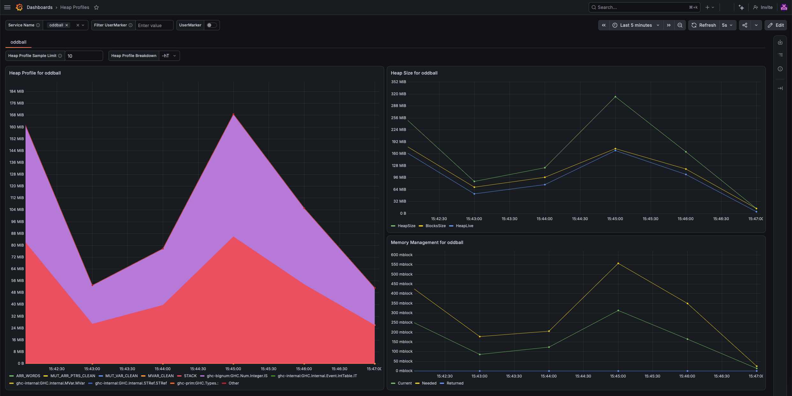
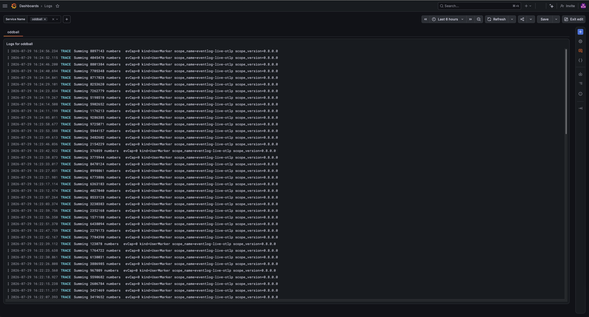

# Using Eventlog Live with Grafana Cloud

This demo shows how to use Eventlog Live to send telemetry data to Grafana Cloud.

To run this demo, you will need:

- A Grafana account.

  If you do not have one, create an account on [grafana.com](https://grafana.com).
  You do not need to register for a paid plan. The free plan is sufficient.

- A copy of this repository.

  Either clone this repository using Git or download the [zip archive](https://github.com/well-typed/eventlog-live/archive/refs/heads/main.zip).

- The dependencies for building Eventlog Live:
  - GHC version 9.4 up to 9.12 (inclusive).
  - Cabal version 3.12 or later.
  - A recent [Protocol Buffer Compiler](https://protobuf.dev/installation/).

## Add an OpenTelemetry receiver

On your Grafana Cloud, take the following steps:

- Select '☰ > Connections > Add new connection'
- Select 'OpenTelemetry'
- Select 'Serverless / Other'
- Enter a token name, e.g., `my-eventlog-live-token', and click 'Create token'.

  The configuration under 'Append the generated configuration' should look like this:

  ```sh
  export OTEL_EXPORTER_OTLP_ENDPOINT="https://otlp-gateway-<REGION>.grafana.net/otlp"
  export  OTEL_EXPORTER_OTLP_HEADERS="Authorization=Basic%20W90T0GUfmNdzEYS7SoygyqLKGHz6wGceF3F0STTW27qsBFpRZP01TNJS7iW4iAQR6DgOLpjN0AD4WTdDxSNLXjDFQaGpwoTdJ2NICOVAhKsWX1MqGYPBtVTJBXnV0kAR4p3HTeicvhgrEc310mouX5DfI1PoR424RsrNJFkKlxaD6PLJ63YsSqCtQZQs7e4ulB7iuXHZD0=="
  ```

  Where `<REGION>` is the region for your Grafana Cloud account and `OTEL_EXPORTER_OTLP_HEADERS` contains some other authentication header.

- Copy the generated configuration to a file named `.env` in this directory.

## Add the Heap Profiles dashboard

On your Grafana Cloud, take the following steps:

- Select '☰ > Dashboards'
- Select 'New > Import dashboard'
- Copy the contents of `./grafana-dashboards/heap-profiles.json` into the textbox.
- Select the appropriate Prometheus and Loki instances.
- Click 'Import'

This should show you an empty Heap Profiles dashboard.

## Add the Logs dashboard

On your Grafana Cloud, take the following steps:

- Select '☰ > Dashboards'
- Select 'New > Import dashboard'
- Copy the contents of `./grafana-dashboards/logs.json` into the textbox.
- Select the appropriate Loki instance.
- Click 'Import'

This should show you an empty Logs dashboard.

## Send telemetry data to your Grafana Cloud

To test whether you've correctly set up the Grafana Cloud, run `./oddball-with-grafana-cloud.sh`.

If everything was done correctly...

- The script should not print any _errors_, though is possible that you'll see some warnings.

- The Heap Profiles dashboard should look like this:

  

- The Logs dashboard should look like this:

  
