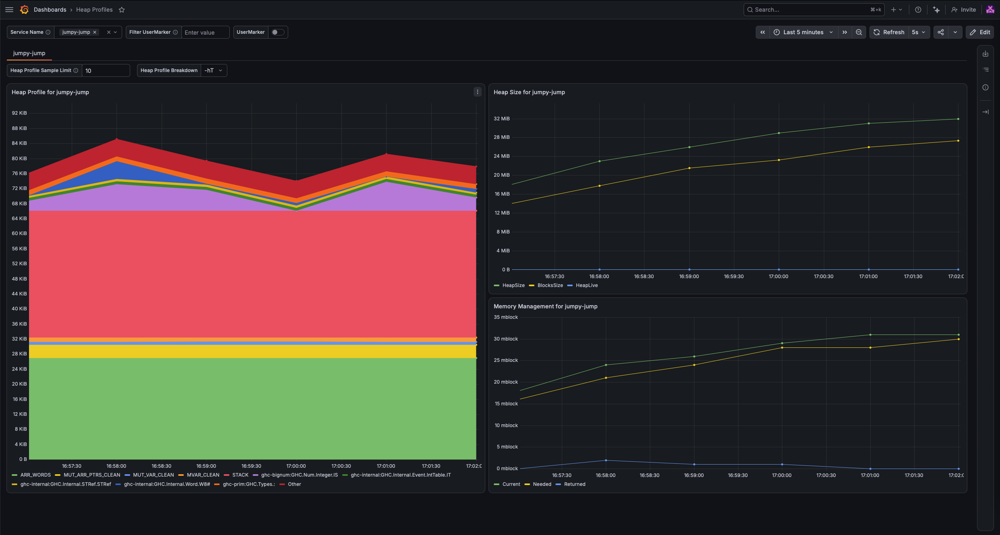
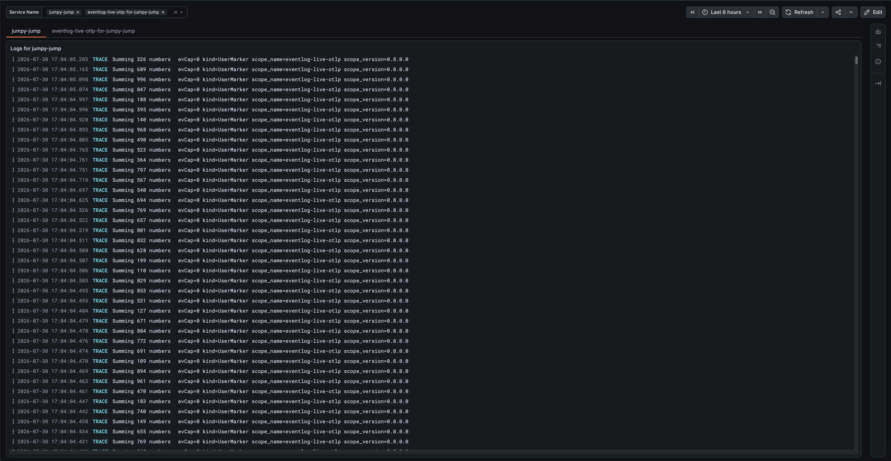
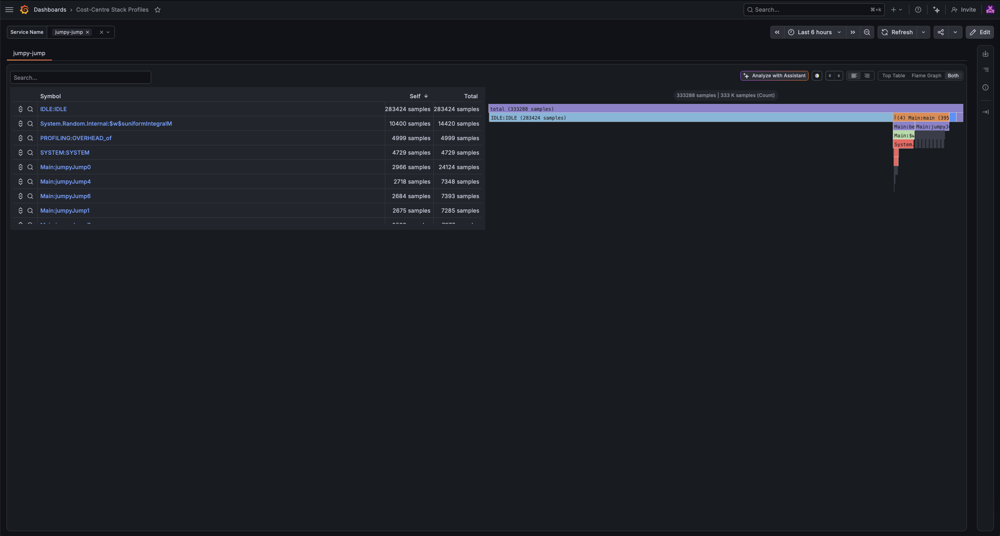

# Using Eventlog Live with Grafana Cloud

This demo shows how to use Eventlog Live to send telemetry data to Grafana Cloud.

It covers:

- Heap Profiles by Closure Type (`-hT`)
- Logs
- Cost-Centre Stack Profiles

Heap Profiles by Info Table (`-hi`) and Call-Stack Profiles _are_ supported by
Grafana Cloud, but these require building your application with a GHC built
with the `+ipe` flavour. See the top-level `README.md` for instructions.

To run this demo, you will need:

- A Grafana account.

  If you do not have one, create an account on [grafana.com](https://grafana.com).
  You do not need to register for a paid plan. The free plan is sufficient.

- A copy of this repository.

  Either clone this repository using Git or download the [zip archive](https://github.com/well-typed/eventlog-live/archive/refs/heads/main.zip).

- The dependencies for building Eventlog Live:
  - GHC version 9.4 up to 9.12 (inclusive).
  - Cabal version 3.12 or later.
  - A recent [Protocol Buffer Compiler](https://protobuf.dev/installation/).

## Add an OpenTelemetry receiver

On your Grafana Cloud, take the following steps:

- Select '☰ > Connections > Add new connection'
- Select 'OpenTelemetry'
- Select 'Serverless / Other'
- Enter a token name, e.g., `my-eventlog-live-token', and click 'Create token'.

  The configuration under 'Append the generated configuration' should look like this:

  ```sh
  export OTEL_EXPORTER_OTLP_ENDPOINT="https://otlp-gateway-<REGION>.grafana.net/otlp"
  export  OTEL_EXPORTER_OTLP_HEADERS="Authorization=Basic%20W90T0GUfmNdzEYS7SoygyqLKGHz6wGceF3F0STTW27qsBFpRZP01TNJS7iW4iAQR6DgOLpjN0AD4WTdDxSNLXjDFQaGpwoTdJ2NICOVAhKsWX1MqGYPBtVTJBXnV0kAR4p3HTeicvhgrEc310mouX5DfI1PoR424RsrNJFkKlxaD6PLJ63YsSqCtQZQs7e4ulB7iuXHZD0=="
  ```

  Where `<REGION>` is the region for your Grafana Cloud account and `OTEL_EXPORTER_OTLP_HEADERS` contains your authentication header.

- Copy the generated configuration to a file named `.env` in this directory.

## Add the Heap Profiles dashboard

On your Grafana Cloud, take the following steps:

- Select '☰ > Dashboards'
- Select 'New > Import dashboard'
- Copy the contents of `./grafana-dashboards/heap-profiles.json` into the textbox.
- Select the appropriate Prometheus and Loki instances.

  The appropriate Prometheus instance is the default one (`grafanacloud-<region>-prom`).
  The appropriate Loki instance is the one for logs (`grafanacloud-<region>-logs`).

- Click 'Import'

This should show you an empty Heap Profiles dashboard.

## Add the Logs dashboard

On your Grafana Cloud, take the following steps:

- Select '☰ > Dashboards'
- Select 'New > Import dashboard'
- Copy the contents of `./grafana-dashboards/logs.json` into the textbox.
- Select the appropriate Loki instance.

  The appropriate Loki instance is the one for logs (`grafanacloud-<region>-logs`).

- Click 'Import'

This should show you an empty Logs dashboard.

## Add the Cost-Centre Stack Profiles dashboard

On your Grafana Cloud, take the following steps:

- Select '☰ > Dashboards'
- Select 'New > Import dashboard'
- Copy the contents of `./grafana-dashboards/cost-centre-stack-profiles.json` into the textbox.
- Select the appropriate Grafana Pyroscope instance.

  The appropriate Grafana Pyroscope instance is the one for profiles (`grafanacloud-<region>-profiles`).

- Click 'Import'

This should show you an empty Logs dashboard.

## Send telemetry data to your Grafana Cloud

To test whether you've correctly set up the Grafana Cloud, run `./jumpy-jump-with-grafana-cloud.sh`.

If everything was done correctly...

- The script should not print any _errors_, though is possible that you'll see some warnings.

- The Heap Profiles dashboard should look like this:

  

- The Logs dashboard should look like this:

  

- The Cost-Centre Stack Profiles dashboard should look like this:

  

## Using dashboards from the `demo` directory

The process of using a dashboard from the `demo/` directory with Grafana Cloud is a bit involved, because those dashboards are not exported for sharing:

1.  Import the dashboard into Grafana Cloud.

    The dashboard won't work in this state, as it does not use the correct data sources.

2.  Export the dashboard from Grafana Cloud with the toggle "Share dashboard with another instance" enabled.

    This creates a JSON export that is ready for its data sources to be remapped on import.

3.  Delete the dashboard from Grafana Cloud.

4.  Import the JSON export created in step (2) into Grafana Cloud.

    Grafana Cloud will ask which data sources to use. Pick the appropriate ones:
    - `grafanacloud-<region>-logs` for logs;
    - `grafanacloud-<region>-prom` for metrics;
    - `grafanacloud-<region>-profiles` for profiles; and
    - `grafanacloud-<region>-traces` for traces.

5.  If the dashboard used metrics, it may use the labels `exported_job` and `exported_instance` in variables and visualisations to refer to the service name and instance ID. These must be changed to `service_name` and `service_instance_id`, respectively.
