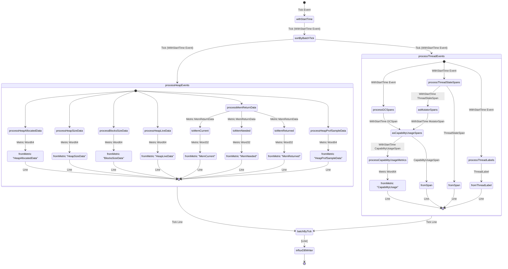

# Developer Notes for `eventlog-live-influxdb`

## Information Flow

The following diagram documents the information flow in the eventlog processor run by the `eventlog-live-influxdb` executable.

```mermaid
stateDiagram-v2
    [*]                               --> withStartTime                 : Tick Event
    withStartTime                     --> sortByBatchTick               : Tick (WithStartTime Event)
    sortByBatchTick                   --> processHeapEvents             : Tick (WithStartTime Event)
    processHeapEvents                 --> batchByTick                   : Tick Line
    state processHeapEvents {
        [*]                           --> processHeapAllocatedData
        fromMetric'HeapAllocatedData                                    : fromMetric "HeapAllocatedData"
        processHeapAllocatedData      --> fromMetric'HeapAllocatedData  : Metric Word64
        fromMetric'HeapAllocatedData  --> [*]                           : Line
        [*]                           --> processHeapSizeData
        fromMetric'HeapSizeData                                         : fromMetric "HeapSizeData"
        processHeapSizeData           --> fromMetric'HeapSizeData       : Metric Word64
        fromMetric'HeapSizeData       --> [*]                           : Line
        [*]                           --> processBlocksSizeData
        fromMetric'BlocksSizeData                                       : fromMetric "BlocksSizeData"
        processBlocksSizeData         --> fromMetric'BlocksSizeData     : Metric Word64
        fromMetric'BlocksSizeData     --> [*]                           : Line
        [*]                           --> processHeapLiveData
        fromMetric'HeapLiveData                                         : fromMetric "HeapLiveData"
        processHeapLiveData           --> fromMetric'HeapLiveData       : Metric Word64
        fromMetric'HeapLiveData       --> [*]                           : Line
        [*]                           --> processMemReturnData
        processMemReturnData          --> toMemCurrent                  : Metric MemReturnData
        fromMetric'MemCurrent                                           : fromMetric "MemCurrent"
        toMemCurrent                  --> fromMetric'MemCurrent         : Metric Word32
        fromMetric'MemCurrent         --> [*]                           : Line
        processMemReturnData          --> toMemNeeded                   : Metric MemReturnData
        fromMetric'MemNeeded                                            : fromMetric "MemNeeded"
        toMemNeeded                  --> fromMetric'MemNeeded           : Metric Word32
        fromMetric'MemNeeded          --> [*]                           : Line
        processMemReturnData          --> toMemReturned                 : Metric MemReturnData
        fromMetric'MemReturned                                          : fromMetric "MemReturned"
        toMemReturned                  --> fromMetric'MemReturned       : Metric Word32
        fromMetric'MemReturned        --> [*]                           : Line
        [*]                           --> processHeapProfSampleData
        fromMetric'HeapProfSampleData                                   : fromMetric "HeapProfSampleData"
        processHeapProfSampleData     --> fromMetric'HeapProfSampleData : Metric Word64
        fromMetric'HeapProfSampleData --> [*]                           : Line
    }
    sortByBatchTick                   --> processThreadEvents           : Tick (WithStartTime Event)
    processThreadEvents               --> batchByTick                   : Tick Line
    state processThreadEvents {
        [*]                           --> processGCSpans                : WithStartTime Event
        processGCSpans                --> asCapabilityUsageSpans        : WithStartTime GCSpan
        [*]                           --> processThreadStateSpans       : WithStartTime Event
        processThreadStateSpans       --> asMutatorSpans                : WithStartTime ThreadStateSpan
        asMutatorSpans                --> asCapabilityUsageSpans        : WithStartTime MutatorSpan
        asCapabilityUsageSpans        --> processCapabilityUsageMetrics : WithStartTime CapabilityUsageSpan
        fromMetric'CapabilityUsage                                      : fromMetric "CapabilityUsage"
        processCapabilityUsageMetrics --> fromMetric'CapabilityUsage    : Metric Word64
        fromMetric'CapabilityUsage    --> [*]                           : Line
        fromCapabilityUsageSpan                                         : fromSpan
        asCapabilityUsageSpans        --> fromCapabilityUsageSpan       : CapabilityUsageSpan
        fromCapabilityUsageSpan       --> [*]                           : Line
        fromThreadStateSpan                                             : fromSpan
        processThreadStateSpans       --> fromThreadStateSpan           : ThreadStateSpan
        fromThreadStateSpan           --> [*]                           : Line
        [*]                           --> processThreadLabels           : WithStartTime Event
        processThreadLabels           --> fromThreadLabel               : ThreadLabel
        fromThreadLabel               --> [*]                           : Line
    }
    batchByTick                       --> influxDBWriter                : [Line]
    influxDBWriter                    --> [*]
```
