# Developer Notes For `eventlog-live-otelcol`

## Modifying The Configuration File Format

The code that governs the configuration file is a bit spread out and can be quite dense.
This is a checklist for how to modify the configuration file format.
Let's assume we wish to add configuration for the `internal_log_message` processor.

### Update The Default Configuration

The default configuration is stored in `data/default.yaml`.
For this particular modification, we'll merge the following data into the schema file.
This uses the default `export` for logs and assigns a default name and description to the processor. The default name for an eventlog processor should start with `ghc_eventlog_` and be followed by a CamelCase name, ideally matching the eventlog event name. The default name for an internal processor should start with `eventlog_live_Internal` and be followed by a descriptive name. The description should be kept to a single sentence, as it may be transferred along the with each batch of data.

```yaml
processors:
  logs:
    internal_log_message:
      name: eventlog_live_InternalLogMessage
      description: An internal eventlog-live log message.
      export: 5s
```

### Update The Haskell Code

The Haskell code that handles the configuration file is strewn across several files, due to the Template Haskell staging restriction. However, the only files you'll need to edit are:

- [ ] `src/GHC/Eventlog/Live/Otelcol/Config/Types.hs`
- [ ] `src/GHC/Eventlog/Live/Otelcol/Config.hs`

First, let's modify `src/GHC/Eventlog/Live/Otelcol/Config/Types.hs` to include a type and some instances for the new processor configuration.
For this particular modification, we'll modify the "Logs" section (search for `/^-- Logs/`).
These sections should be kept as two alphabetically ordered lists of eventlog processor configurations followed by internal processor configurations. In this case, that means we'll add the following code at the end of the "Logs" section.
The name of the type should be equal to the suffix of the processor name (i.e., `eventlog_live_InternalLogMessage`) and the CamelCase equivalent of the processor property name (i.e., `internal_log_message`). Each processor _must_ have a `name`, `description`, and `export` field, but it may have any other fields. If it does have other fields, you'll need to write custom `parseYAML` and `toYAML` functions. In this case, we can use the generic functions.

```haskell
{- |
The configuration options for internal log messages.
-}
data InternalLogMessage = InternalLogMessage
  { name :: Maybe Text
  , description :: Maybe Text
  , export :: Maybe ExportStrategy
  }
  deriving (Lift)

instance FromYAML InternalLogMessage where
  parseYAML :: YAML.Node YAML.Pos -> YAML.Parser InternalLogMessage
  parseYAML = genericParseYAMLLogProcessorConfig "InternalLogMessage" InternalLogMessage

instance ToYAML InternalLogMessage where
  toYAML :: InternalLogMessage -> YAML.Node ()
  toYAML = genericToYAMLLogProcessorConfig

instance HasField "enabled" InternalLogMessage Bool where
  getField :: InternalLogMessage -> Bool
  getField = isEnabled . (.export)
```

Second, we'll modify the appropriate processor group to add our new processor configuration.
The types for these processor groups are near the top of the file.
For this particular modification, we'll modify the `Logs` type to add the following field:

```diff
  data Logs = Logs
    { threadLabel :: Maybe ThreadLabel
    , userMarker :: Maybe UserMarker
    , userMessage :: Maybe UserMessage
+   , internalLogMessage :: Maybe InternalLogMessage
    }
    deriving (Lift)
```

Furthermore, we'll modify the `FromYAML` and `ToYAML` instances to parse and produce this field:

```diff
  instance FromYAML Logs where
    parseYAML :: YAML.Node YAML.Pos -> YAML.Parser Logs
    parseYAML =
      -- NOTE: This should be kept in sync with the list of logs.
      YAML.withMap "Logs" $ \m ->
        Logs
          <$> m .:? "thread_label"
          <*> m .:? "user_marker"
          <*> m .:? "user_message"
+         <*> m .:? "internal_log_message"

  instance ToYAML Logs where
    toYAML :: Logs -> YAML.Node ()
    toYAML logs =
      -- NOTE: This should be kept in sync with the list of logs.
      YAML.mapping
        [ "thread_label" .= logs.threadLabel
        , "user_marker" .= logs.userMarker
        , "user_message" .= logs.userMessage
+       , "internal_log_message" .= logs.internalLogMessage
        ]
```

Finally, add your processor configuration type to the appropriate place in the export list.

Let's move on to the `src/GHC/Eventlog/Live/Otelcol/Config.hs` file.

First, let's define a `Default` instance for our new processor configuration type. This should be added to the appropriate position, following the same order as in the previous file.

```haskell
instance Default InternalLogMessage where
  def :: InternalLogMessage
  def = $(getDefault @'["processors", "logs", "internalLogMessage"] defaultConfig)
```

The `getDefault` macro parses the default configuration from the YAML file and inserts into this file at compile-time. If you've done this correctly and you remove your processor configuration from the default configuration file, you should now get a compile error.

```
src/GHC/Eventlog/Live/Otelcol/Config.hs:185:9: error: [GHC-87897]
    • Exception when trying to run compile-time code:
        Missing property 'processors.logs.internalLogMessage' in default configuration
      Code: (getDefault @'["processors", "logs", "internalLogMessage"]
               defaultConfig)
    • In the untyped splice:
        $(getDefault
            @'["processors", "logs", "internalLogMessage"] defaultConfig)
    |
185 |   def = $(getDefault @'["processors", "logs", "internalLogMessage"] defaultConfig)
    |         ^^^^^^^^^^^^^^^^^^^^^^^^^^^^^^^^^^^^^^^^^^^^^^^^^^^^^^^^^^^^^^^^^^^^^^^^^^
```

Second, let's modify the appropriate iterator. Since each configuration type may contain arbitrary extra fields, each has its own data type. To allow us to treat them uniformly to some extent, there are various constraints such as `IsLogProcessorConfig` and corresponding iterators such as `forEachLogProcessor`. For this particular modification, we must add our new log processor to the definition of `forEachLogProcessor`:

```diff
  forEachLogProcessor f logs =
    [ -- NOTE: This should be kept in sync with the list of logs.
      f $ fromMaybe def logs.threadLabel
    , f $ fromMaybe def logs.userMarker
    , f $ fromMaybe def logs.userMessage
+   , f $ fromMaybe def logs.internalLogMessage
    ]
```

Finally, add your processor configuration type to the appropriate place in the export list.

Let's check if we haven't forgotten anything.

Any place in the codebase that must be modified when you add a new processor configuration _must_ be annotated with the following comment, verbatim, except replacing "logs" with the name of the relevant type of telemetry data:

```haskell
-- NOTE: This should be kept in sync with the list of logs.
```

To check that we haven't forgotten anything, seach the codebase for the appropriate string and verify that you've updated each location.

To check that your new processor configuration shows up, run the following commands and verify that your new processor configuration is present in the output of each:

```sh
# The `--print-defaults` flag should print the contents of
# the default configuration file verbatim.
cabal run eventlog-live-otelcol -- --print-defaults

# The `--print-defaults-debug` flag should print the result
# of calling `toYAML` on the `Default` instance for `Config`.
cabal run eventlog-live-otelcol -- --print-defaults-debug
```

### Update The JSON Schema

The JSON Schema for the configuration file format is stored in `data/config.schema.json`.
For this particular modification, we'll merge the following data into the schema file.

The path `properties.processors.properties.logs.properties` already existed. Likewise, the definition for log processor configurations `#/definitions/log` already existed under `definitions.log`. All we're doing is to say that the `processors.logs` object may have a property called `internal_log_message` which should have the form of a log processor configuration.

```json
{
  "properties": {
    "processors": {
      "type": "object",
      "properties": {
        "logs": {
          "type": "object",
          "properties": {
            "internal_log_message": { "#ref": "#/definitions/log" }
          }
        }
      }
    }
  }
}
```

## Information Flow

The following diagram documents the information flow in the eventlog processor run by the `eventlog-live-otelcol` executable.

> [!WARNING]
> This diagram is out-of-date.
> It does not contain information regarding logs.

```mermaid
stateDiagram-v2
    [*]                                                 --> withStartTime                                   : Tick Event

    withStartTime                                       --> processHeapEvents                               : Tick (WithStartTime Event)
    state processHeapEvents {
        [*]                                             --> processHeapAllocated
        processHeapAllocated'asNumberDataPoint                                                              : asNumberDataPoint
        processHeapAllocated                            --> processHeapAllocated'asNumberDataPoint          : Tick (Metric Word64)
        processHeapAllocated'asSum                                                                          : asSum
        processHeapAllocated'batchByTick                                                                    : batchByTick
        processHeapAllocated'asNumberDataPoint          --> processHeapAllocated'batchByTick                : Tick OTLP.NumberDataPoint
        processHeapAllocated'batchByTick                --> processHeapAllocated'asSum                      : [OTLP.NumberDataPoint]
        processHeapAllocated'asMetric                                                                       : asMetric
        processHeapAllocated'asSum                      --> processHeapAllocated'asMetric                   : OTLP.Sum
        processHeapAllocated'asMetric                   --> [*]

        [*]                                             --> processBlocksSize
        processBlocksSize'asNumberDataPoint                                                                 : asNumberDataPoint
        processBlocksSize                               --> processBlocksSize'asNumberDataPoint             : Tick (Metric Word64)
        processBlocksSize'asGauge                                                                           : asGauge
        processBlocksSize'batchByTick                                                                       : batchByTick
        processBlocksSize'asNumberDataPoint             --> processBlocksSize'batchByTick                   : Tick OTLP.NumberDataPoint
        processBlocksSize'batchByTick                   --> processBlocksSize'asGauge                       : [OTLP.NumberDataPoint]
        processBlocksSize'asMetric                                                                          : asMetric
        processBlocksSize'asGauge                       --> processBlocksSize'asMetric                      : OTLP.Gauge
        processBlocksSize'asMetric                      --> [*]

        [*]                                             --> processHeapSize
        processHeapSize'asNumberDataPoint                                                                   : asNumberDataPoint
        processHeapSize                                 --> processHeapSize'asNumberDataPoint               : Tick (Metric Word64)
        processHeapSize'asGauge                                                                             : asGauge
        processHeapSize'batchByTick                                                                         : batchByTick
        processHeapSize'asNumberDataPoint               --> processHeapSize'batchByTick                     : Tick OTLP.NumberDataPoint
        processHeapSize'batchByTick                     --> processHeapSize'asGauge                         : [OTLP.NumberDataPoint]
        processHeapSize'asMetric                                                                            : asMetric
        processHeapSize'asGauge                         --> processHeapSize'asMetric                        : OTLP.Gauge
        processHeapSize'asMetric                        --> [*]

        [*]                                             --> processHeapLive
        processHeapLive'asNumberDataPoint                                                                   : asNumberDataPoint
        processHeapLive                                 --> processHeapLive'asNumberDataPoint               : Tick (Metric Word64)
        processHeapLive'asGauge                                                                             : asGauge
        processHeapLive'batchByTick                                                                         : batchByTick
        processHeapLive'asNumberDataPoint               --> processHeapLive'batchByTick                     : Tick OTLP.NumberDataPoint
        processHeapLive'batchByTick                     --> processHeapLive'asGauge                         : [OTLP.NumberDataPoint]
        processHeapLive'asMetric                                                                            : asMetric
        processHeapLive'asGauge                         --> processHeapLive'asMetric                        : OTLP.Gauge
        processHeapLive'asMetric                        --> [*]

        [*]                                             --> processMemReturn
        processMemReturn                                --> asMemCurrent                                    : Tick (Metric MemReturnData)
        asMemCurrent'asNumberDataPoint                                                                      : asNumberDataPoint
        asMemCurrent                                    --> asMemCurrent'asNumberDataPoint                  : Tick (Metric Word32)
        asMemCurrent'asGauge                                                                                : asGauge
        asMemCurrent'batchByTick                                                                            : batchByTick
        asMemCurrent'asNumberDataPoint                  --> asMemCurrent'batchByTick                        : Tick OTLP.NumberDataPoint
        asMemCurrent'batchByTick                        --> asMemCurrent'asGauge                            : [OTLP.NumberDataPoint]
        asMemCurrent'asMetric                                                                               : asMetric
        asMemCurrent'asGauge                            --> asMemCurrent'asMetric                           : OTLP.Gauge
        asMemCurrent'asMetric                           --> [*]

        processMemReturn                                --> asMemNeeded                                     : Tick (Metric MemReturnData)
        asMemNeeded'asNumberDataPoint                                                                       : asNumberDataPoint
        asMemNeeded                                     --> asMemNeeded'asNumberDataPoint                   : Tick (Metric Word32)
        asMemNeeded'asGauge                                                                                 : asGauge
        asMemNeeded'batchByTick                                                                             : batchByTick
        asMemNeeded'asNumberDataPoint                   --> asMemNeeded'batchByTick                         : Tick OTLP.NumberDataPoint
        asMemNeeded'batchByTick                         --> asMemNeeded'asGauge                             : [OTLP.NumberDataPoint]
        asMemNeeded'asMetric                                                                                : asMetric
        asMemNeeded'asGauge                             --> asMemNeeded'asMetric                            : OTLP.Gauge
        asMemNeeded'asMetric                            --> [*]

        processMemReturn                                --> asMemReturned                                   : Tick (Metric MemReturnData)
        asMemReturned'asNumberDataPoint                                                                     : asNumberDataPoint
        asMemReturned                                   --> asMemReturned'asNumberDataPoint                 : Tick (Metric Word32)
        asMemReturned'asGauge                                                                               : asGauge
        asMemReturned'batchByTick                                                                           : batchByTick
        asMemReturned'asNumberDataPoint                 --> asMemReturned'batchByTick                       : Tick OTLP.NumberDataPoint
        asMemReturned'batchByTick                       --> asMemReturned'asGauge                           : [OTLP.NumberDataPoint]
        asMemReturned'asMetric                                                                              : asMetric
        asMemReturned'asGauge                           --> asMemReturned'asMetric                          : OTLP.Gauge
        asMemReturned'asMetric                          --> [*]

        [*]                                             --> processHeapProfSample
        processHeapProfSample'asNumberDataPoint                                                             : asNumberDataPoint
        processHeapProfSample                           --> processHeapProfSample'asNumberDataPoint         : Tick (Metric Word64)
        processHeapProfSample'asGauge                                                                       : asGauge
        processHeapProfSample'batchByTick                                                                   : batchByTick
        processHeapProfSample'asNumberDataPoint         --> processHeapProfSample'batchByTick               : Tick OTLP.NumberDataPoint
        processHeapProfSample'batchByTick               --> processHeapProfSample'asGauge                   : [OTLP.NumberDataPoint]
        processHeapProfSample'asMetric                                                                      : asMetric
        processHeapProfSample'asGauge                   --> processHeapProfSample'asMetric                  : OTLP.Gauge
        processHeapProfSample'asMetric                  --> [*]
    }

    withStartTime                                       --> processThreadEvents                             : Tick (WithStartTime Event)
    state processThreadEvents {
        processThreadEvents'batchByTick                                                                     : batchByTick
        [*]                                             --> processThreadEvents'batchByTick
        processThreadEvents'sortByBatch                                                                     : sortByBatch
        processThreadEvents'batchByTick                 --> processThreadEvents'sortByBatch                 : [WithStartTime Event]

        processThreadEvents'sortByBatch                 --> processGCSpans                                  : [WithStartTime Event]
        processGCSpans                                  --> asCapabilityUsageSpans                          : [GCSpan]

        processThreadEvents'sortByBatch                 --> processThreadStateSpans                         : [WithStartTime Event]
        processThreadStateSpans                         --> asMutatorSpan                                   : [ThreadStateSpan]

        asMutatorSpan                                   --> asCapabilityUsageSpans                          : [MutatorSpan]
        asCapabilityUsageSpans'asSpan                                                                       : asSpan
        asCapabilityUsageSpans                          --> asCapabilityUsageSpans'asSpan                   : [OT.Span]
        asCapabilityUsageSpans'asSpan                   --> processThreadEvents'asRight                     : [OTLP.Span]

        processThreadStateSpans'asSpan                                                                      : asSpan
        processThreadStateSpans                         --> processThreadStateSpans'asSpan                  : [ThreadStateSpan]
        processThreadStateSpans'asSpan                  --> processThreadEvents'asRight                     : [OTLP.Span]

        asCapabilityUsageSpans                          --> processCapabilityUsageMetrics                   : [CapabilityUsageSpan]
        processCapabilityUsageMetrics'asNumberDataPoint                                                     : asNumberDataPoint
        processCapabilityUsageMetrics                   --> processCapabilityUsageMetrics'asNumberDataPoint : [Metric Double]
        processCapabilityUsageMetrics'asSum                                                                 : asSum
        processCapabilityUsageMetrics'asNumberDataPoint --> processCapabilityUsageMetrics'asSum             : [OTLP.NumberDataPoint]
        processCapabilityUsageMetrics'asMetric                                                              : asMetric
        processCapabilityUsageMetrics'asSum             --> processCapabilityUsageMetrics'asMetric          : OTLP.Sum
        processCapabilityUsageMetrics'asLeft                                                                : asLeft
        processCapabilityUsageMetrics'asMetric          --> processCapabilityUsageMetrics'asLeft            : OTLP.Metric
        processCapabilityUsageMetrics'asLeft            --> [*]

        processThreadEvents'asRight                                                                         : asRight
        processThreadEvents'asRight                     --> [*]
    }

    processHeapEvents'asLeft                                                                                : asLeft
    processHeapEvents                                   --> processHeapEvents'asLeft                        : OTLP.Metric

    state splitEither <<choice>>
    processHeapEvents'asLeft                            --> splitEither                                     : OTLP.Metric ⊎ OTLP.Span
    processThreadEvents                                 --> splitEither                                     : OTLP.Metric ⊎ OTLP.Span

    splitEither                                         --> exportResourceMetrics                           : OTLP.Metric
    state exportResourceMetrics {
        [*]                                             --> asScopeMetrics
        asScopeMetrics                                  --> asResourceMetrics                               : OTLP.ScopeMetrics
        asResourceMetrics                               --> OTLP.ExportMetricsService                       : OTLP.ResourceMetrics
        OTLP.ExportMetricsService                       --> [*]
    }

    splitEither                                         --> exportResourceSpans                             : OTLP.Span
    state exportResourceSpans {
        [*]                                             --> asScopeSpans
        asScopeSpans                                    --> asResourceSpans                                 : OTLP.ScopeSpans
        asResourceSpans                                 --> OTLP.ExportTracesService                        : OTLP.ResourceSpans
        OTLP.ExportTracesService                        --> [*]
    }
```


