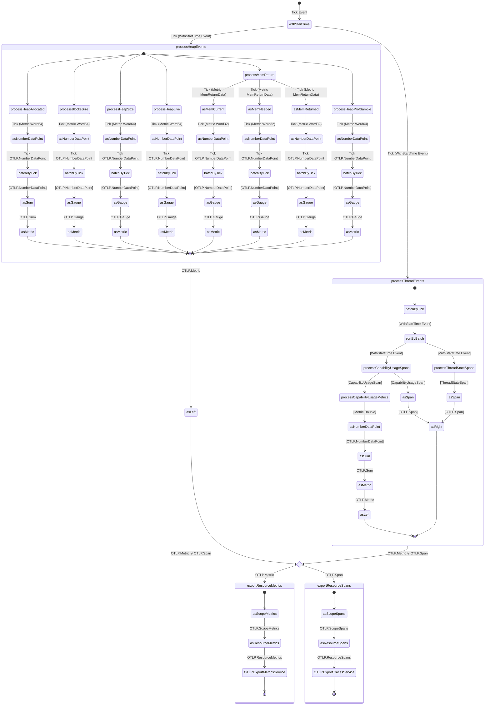

```mermaid
stateDiagram-v2
    [*]                                                 --> withStartTime                                   : Tick Event

    withStartTime                                       --> processHeapEvents                               : Tick (WithStartTime Event)
    state processHeapEvents {
        [*]                                             --> processHeapAllocated
        processHeapAllocated'asNumberDataPoint                                                              : asNumberDataPoint
        processHeapAllocated                            --> processHeapAllocated'asNumberDataPoint          : Tick (Metric Word64)
        processHeapAllocated'asSum                                                                          : asSum
        processHeapAllocated'batchByTick                                                                    : batchByTick
        processHeapAllocated'asNumberDataPoint          --> processHeapAllocated'batchByTick                : Tick OTLP.NumberDataPoint
        processHeapAllocated'batchByTick                --> processHeapAllocated'asSum                      : [OTLP.NumberDataPoint]
        processHeapAllocated'asMetric                                                                       : asMetric
        processHeapAllocated'asSum                      --> processHeapAllocated'asMetric                   : OTLP.Sum
        processHeapAllocated'asMetric                   --> [*]

        [*]                                             --> processBlocksSize
        processBlocksSize'asNumberDataPoint                                                                 : asNumberDataPoint
        processBlocksSize                               --> processBlocksSize'asNumberDataPoint             : Tick (Metric Word64)
        processBlocksSize'asGauge                                                                           : asGauge
        processBlocksSize'batchByTick                                                                       : batchByTick
        processBlocksSize'asNumberDataPoint             --> processBlocksSize'batchByTick                   : Tick OTLP.NumberDataPoint
        processBlocksSize'batchByTick                   --> processBlocksSize'asGauge                       : [OTLP.NumberDataPoint]
        processBlocksSize'asMetric                                                                          : asMetric
        processBlocksSize'asGauge                       --> processBlocksSize'asMetric                      : OTLP.Gauge
        processBlocksSize'asMetric                      --> [*]

        [*]                                             --> processHeapSize
        processHeapSize'asNumberDataPoint                                                                   : asNumberDataPoint
        processHeapSize                                 --> processHeapSize'asNumberDataPoint               : Tick (Metric Word64)
        processHeapSize'asGauge                                                                             : asGauge
        processHeapSize'batchByTick                                                                         : batchByTick
        processHeapSize'asNumberDataPoint               --> processHeapSize'batchByTick                     : Tick OTLP.NumberDataPoint
        processHeapSize'batchByTick                     --> processHeapSize'asGauge                         : [OTLP.NumberDataPoint]
        processHeapSize'asMetric                                                                            : asMetric
        processHeapSize'asGauge                         --> processHeapSize'asMetric                        : OTLP.Gauge
        processHeapSize'asMetric                        --> [*]

        [*]                                             --> processHeapLive
        processHeapLive'asNumberDataPoint                                                                   : asNumberDataPoint
        processHeapLive                                 --> processHeapLive'asNumberDataPoint               : Tick (Metric Word64)
        processHeapLive'asGauge                                                                             : asGauge
        processHeapLive'batchByTick                                                                         : batchByTick
        processHeapLive'asNumberDataPoint               --> processHeapLive'batchByTick                     : Tick OTLP.NumberDataPoint
        processHeapLive'batchByTick                     --> processHeapLive'asGauge                         : [OTLP.NumberDataPoint]
        processHeapLive'asMetric                                                                            : asMetric
        processHeapLive'asGauge                         --> processHeapLive'asMetric                        : OTLP.Gauge
        processHeapLive'asMetric                        --> [*]

        [*]                                             --> processMemReturn
        processMemReturn                                --> asMemCurrent                                    : Tick (Metric MemReturnData)
        asMemCurrent'asNumberDataPoint                                                                      : asNumberDataPoint
        asMemCurrent                                    --> asMemCurrent'asNumberDataPoint                  : Tick (Metric Word32)
        asMemCurrent'asGauge                                                                                : asGauge
        asMemCurrent'batchByTick                                                                            : batchByTick
        asMemCurrent'asNumberDataPoint                  --> asMemCurrent'batchByTick                        : Tick OTLP.NumberDataPoint
        asMemCurrent'batchByTick                        --> asMemCurrent'asGauge                            : [OTLP.NumberDataPoint]
        asMemCurrent'asMetric                                                                               : asMetric
        asMemCurrent'asGauge                            --> asMemCurrent'asMetric                           : OTLP.Gauge
        asMemCurrent'asMetric                           --> [*]

        processMemReturn                                --> asMemNeeded                                     : Tick (Metric MemReturnData)
        asMemNeeded'asNumberDataPoint                                                                       : asNumberDataPoint
        asMemNeeded                                     --> asMemNeeded'asNumberDataPoint                   : Tick (Metric Word32)
        asMemNeeded'asGauge                                                                                 : asGauge
        asMemNeeded'batchByTick                                                                             : batchByTick
        asMemNeeded'asNumberDataPoint                   --> asMemNeeded'batchByTick                         : Tick OTLP.NumberDataPoint
        asMemNeeded'batchByTick                         --> asMemNeeded'asGauge                             : [OTLP.NumberDataPoint]
        asMemNeeded'asMetric                                                                                : asMetric
        asMemNeeded'asGauge                             --> asMemNeeded'asMetric                            : OTLP.Gauge
        asMemNeeded'asMetric                            --> [*]

        processMemReturn                                --> asMemReturned                                   : Tick (Metric MemReturnData)
        asMemReturned'asNumberDataPoint                                                                     : asNumberDataPoint
        asMemReturned                                   --> asMemReturned'asNumberDataPoint                 : Tick (Metric Word32)
        asMemReturned'asGauge                                                                               : asGauge
        asMemReturned'batchByTick                                                                           : batchByTick
        asMemReturned'asNumberDataPoint                 --> asMemReturned'batchByTick                       : Tick OTLP.NumberDataPoint
        asMemReturned'batchByTick                       --> asMemReturned'asGauge                           : [OTLP.NumberDataPoint]
        asMemReturned'asMetric                                                                              : asMetric
        asMemReturned'asGauge                           --> asMemReturned'asMetric                          : OTLP.Gauge
        asMemReturned'asMetric                          --> [*]

        [*]                                             --> processHeapProfSample
        processHeapProfSample'asNumberDataPoint                                                             : asNumberDataPoint
        processHeapProfSample                           --> processHeapProfSample'asNumberDataPoint         : Tick (Metric Word64)
        processHeapProfSample'asGauge                                                                       : asGauge
        processHeapProfSample'batchByTick                                                                   : batchByTick
        processHeapProfSample'asNumberDataPoint         --> processHeapProfSample'batchByTick               : Tick OTLP.NumberDataPoint
        processHeapProfSample'batchByTick               --> processHeapProfSample'asGauge                   : [OTLP.NumberDataPoint]
        processHeapProfSample'asMetric                                                                      : asMetric
        processHeapProfSample'asGauge                   --> processHeapProfSample'asMetric                  : OTLP.Gauge
        processHeapProfSample'asMetric                  --> [*]
    }

    withStartTime                                       --> processThreadEvents                             : Tick (WithStartTime Event)
    state processThreadEvents {
        processThreadEvents'batchByTick                                                                     : batchByTick
        [*]                                             --> processThreadEvents'batchByTick
        processThreadEvents'sortByBatch                                                                     : sortByBatch
        processThreadEvents'batchByTick                 --> processThreadEvents'sortByBatch                 : [WithStartTime Event]
        processThreadEvents'sortByBatch                 --> processCapabilityUsageSpans                     : [WithStartTime Event]

        processCapabilityUsageSpans                     --> processCapabilityUsageMetrics                   : [CapabilityUsageSpan]
        processCapabilityUsageMetrics'asNumberDataPoint                                                     : asNumberDataPoint
        processCapabilityUsageMetrics                   --> processCapabilityUsageMetrics'asNumberDataPoint : [Metric Double]
        processCapabilityUsageMetrics'asSum                                                                 : asSum
        processCapabilityUsageMetrics'asNumberDataPoint --> processCapabilityUsageMetrics'asSum             : [OTLP.NumberDataPoint]
        processCapabilityUsageMetrics'asMetric                                                              : asMetric
        processCapabilityUsageMetrics'asSum             --> processCapabilityUsageMetrics'asMetric          : OTLP.Sum
        processCapabilityUsageMetrics'asLeft                                                                : asLeft
        processCapabilityUsageMetrics'asMetric          --> processCapabilityUsageMetrics'asLeft            : OTLP.Metric
        processCapabilityUsageMetrics'asLeft            --> [*]

        processCapabilityUsageSpans'asSpan                                                                  : asSpan
        processCapabilityUsageSpans                     --> processCapabilityUsageSpans'asSpan              : [CapabilityUsageSpan]
        processCapabilityUsageSpans'asSpan              --> processThreadEvents'asRight                     : [OTLP.Span]

        processThreadEvents'sortByBatch                 --> processThreadStateSpans                         : [WithStartTime Event]
        processThreadStateSpans'asSpan                                                                      : asSpan
        processThreadStateSpans                         --> processThreadStateSpans'asSpan                  : [ThreadStateSpan]
        processThreadStateSpans'asSpan                  --> processThreadEvents'asRight                     : [OTLP.Span]

        processThreadEvents'asRight                                                                         : asRight
        processThreadEvents'asRight                     --> [*]
    }

    processHeapEvents'asLeft                                                                                : asLeft
    processHeapEvents                                   --> processHeapEvents'asLeft                        : OTLP.Metric

    state splitEither <<choice>>
    processHeapEvents'asLeft                            --> splitEither                                     : OTLP.Metric ⊎ OTLP.Span
    processThreadEvents                                 --> splitEither                                     : OTLP.Metric ⊎ OTLP.Span

    splitEither                                         --> exportResourceMetrics                           : OTLP.Metric
    state exportResourceMetrics {
        [*]                                             --> asScopeMetrics
        asScopeMetrics                                  --> asResourceMetrics                               : OTLP.ScopeMetrics
        asResourceMetrics                               --> OTLP.ExportMetricsService                       : OTLP.ResourceMetrics
        OTLP.ExportMetricsService                       --> [*]
    }

    splitEither                                         --> exportResourceSpans                             : OTLP.Span
    state exportResourceSpans {
        [*]                                             --> asScopeSpans
        asScopeSpans                                    --> asResourceSpans                                 : OTLP.ScopeSpans
        asResourceSpans                                 --> OTLP.ExportTracesService                        : OTLP.ResourceSpans
        OTLP.ExportTracesService                        --> [*]
    }
```
