# Developer Notes for `eventlog-live`

This file contains developer notes for the `eventlog-live` package.

## Threading Analyses

### Threading Events

The `ThreadRunnable` event should not be used to analyse thread state, since it was dropped in [0e51109d](https://gitlab.haskell.org/ghc/ghc/-/commit/0e51109d010c474f60f7b3209e399c115c7bcec7) after not being used since [f361281c](https://gitlab.haskell.org/coot/ghc/-/commit/f361281c89fbce42865d8b8b27b0957205366186).

The `WakeupThread` event does not denote a thread state transition, but merely signifies that one thread has attempted to wake up another thread.

The GHC RTS frequently emits a pair of `RunThread` and `WakeupThread` events immediately after a `StopThread` event with the `ThreadFinished` status. Hence, once the final state is reached, all events, including `RunThread` events, are ignored.

### Thread State Analysis

The thread state analysis produces thread state spans and follows this finite-state automaton.
Unlike the [Mutator Span Analysis](#mutator-span-analysis), the thread events are not indexed by thread ID, because each thread-state analysis automaton only handles thread events for one specific thread.
Each `StopThread` event has a `status` field (which can be either `ThreadFinished` or not).

```mermaid
stateDiagram-v2
  direction RL

  state Running
  state Blocked
  state StopThread <<choice>>

  [*]        --> Running    : RunThread
  Blocked    --> Running    : RunThread
  Running    --> Running    : RunThread
  Running    --> StopThread : StopThread
  Blocked    --> StopThread : StopThread
  StopThread --> Blocked    : status≠ThreadFinished
  StopThread --> [*]        : status=ThreadFinished
```

The transition from `Running` to `Blocked` yields a thread state span with the `Running` category and the capability on which the thread is running. The transition from `Running` to `Running` does not yield any span, but the start of the span is adjusted to be the ealier of the two events. There is no need to adjust the capability, since running threads cannot be migrated.

The transitions from `Blocked` to `Running` and `Blocked` to `Blocked` yield thread state spans with the `Blocked` category and the reason why the thread is blocked. Each successive `Blocked` to `Blocked` transition yields another span, because the reason that the thread is blocked may change over time, e.g., from "yielding to the scheduler" to "blocked on an MVar".

### Capability Usage Analysis

The capability usage analysis combines the GC span and mutator span analyses.
It classifies any time not covered by either a GC span or a mutator span as idle time.

#### GC Span Analysis

The GC span analysis produces GC spans and follows this finite-state automaton:

The transition from `GC` to `Idle` yields a GC span.

#### Mutator Span Analysis

The mutator span analysis reuses the thread state analysis and produces a mutator span for every thread state span whose thread state is `Running`.
