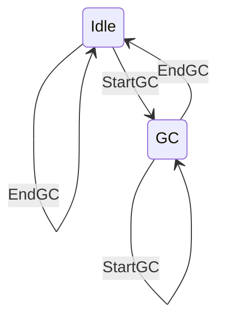
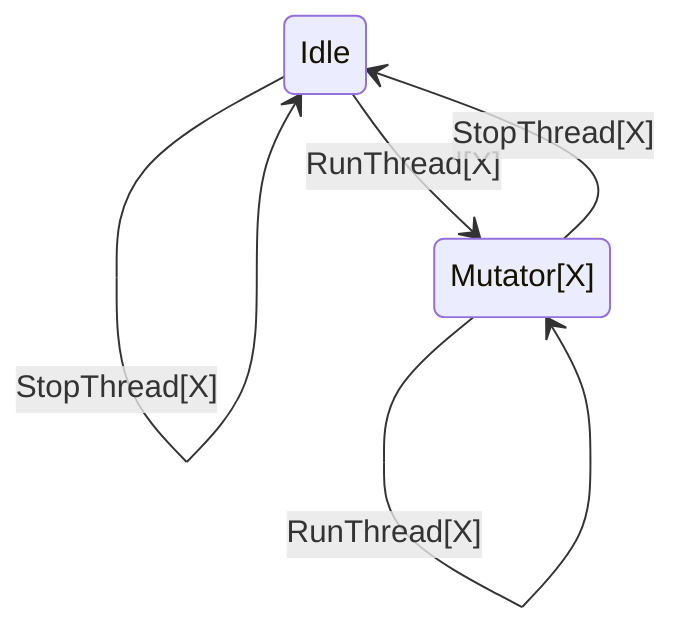
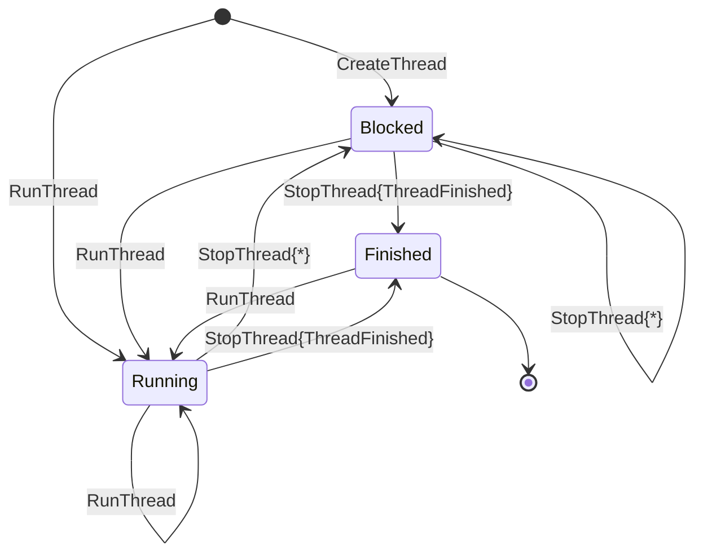

## Capability Usage Analysis

The capability usage analysis combines the GC span and mutator span analyses.
It classifies any time not covered by either a GC span or a mutator span as idle time.

### GC Span Analysis

The GC span analysis produces GC spans and follows this finite-state automaton:

The transition from `GC` to `Idle` yields a GC span.

### Mutator Span Analysis

The mutator span analysis produces mutator spans and follows this finite-state automaton:

The transition from `Mutator[X]` to `Idle` yields a mutator span.
While in the `Mutator[X]` state, any `RunThread[Y]` or `StopThread[Y]` events result in an error. Furthermore, when a `StopThread[X]` event with the `ThreadFinished` status is processed, the thread `X` is added to a set of finished threads, and any further `RunThread[X]` events for that thread are ignored. This is done because the GHC RTS frequently emits a `RunThread[X]` event immediately after a `StopThread[X]` event with the `ThreadFinished` status.

## Thread State Analysis

---

The label `StopThread{ThreadFinished}` refers to the `StopThread{status}` event where `status == ThreadFinished`
and the label `StopThread{*}` refers to all other cases of the `StopThread` event.

The `ThreadRunnable` event was dropped in [0e51109d](https://gitlab.haskell.org/ghc/ghc/-/commit/0e51109d010c474f60f7b3209e399c115c7bcec7) after not being used since [f361281c](https://gitlab.haskell.org/coot/ghc/-/commit/f361281c89fbce42865d8b8b27b0957205366186).

The `WakeupThread` event does not denote a thread state transition, but merely signifies that one thread has attempted to wake up another thread.
