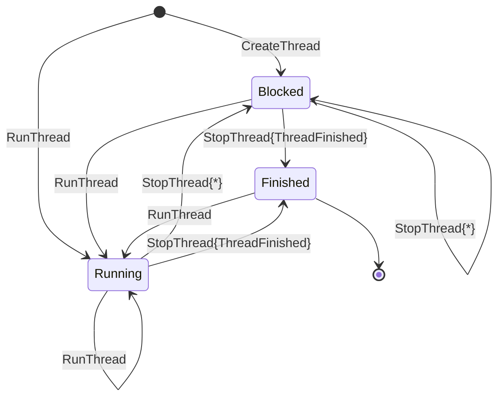

## Thread State Analysis

---

The label `StopThread{ThreadFinished}` refers to the `StopThread{status}` event where `status == ThreadFinished`
and the label `StopThread{*}` refers to all other cases of the `StopThread` event.

The `ThreadRunnable` event was dropped in [0e51109d](https://gitlab.haskell.org/ghc/ghc/-/commit/0e51109d010c474f60f7b3209e399c115c7bcec7) after not being used since [f361281c](https://gitlab.haskell.org/coot/ghc/-/commit/f361281c89fbce42865d8b8b27b0957205366186).

The `WakeupThread` event does not denote a thread state transition, but merely signifies that one thread has attempted to wake up another thread.
